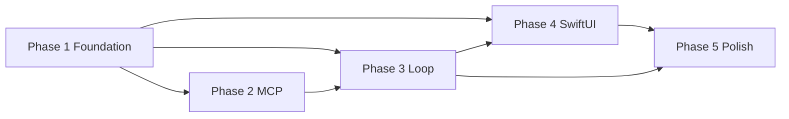

# AetherForge Roadmap — Phases 1–5

**Baseline:** commit `32034ed` — Darwin **10/10 harness (6 hard / 4 soft)** per independent audit  
**Canonical platform:** Darwin (macOS 15+ Apple Silicon)  
**Linux CI:** fail-closed for FS-02, MEM-01, ROUT-01 when `sandbox-exec` or Ollama absent  

---

## Global Gates & Honesty Rules

These apply to **every phase**. No exceptions.

| Gate | Rule |
|------|------|
| **Hard green** | A task is **hard** only when production crate code enforces the invariant (not harness-only simulation). Claiming "hard green" requires the independent audit checklist for that phase to pass. |
| **README scoreboard** | README must show `X/10 harness (Y hard)` — never claim 10/10 without running `cargo run -p golden-harness` on Darwin. |
| **Darwin canonical** | FS-02 (Seatbelt), MEM-01 (Ollama embed), ROUT-01 (Ollama chat stream) are canonical on Darwin. |
| **Linux fail-closed** | Missing `sandbox-exec` or Ollama → explicit FAIL, never bypass or skip. |
| **Independent audit** | Each phase ends with a checklist an auditor can run without reading source. |
| **Regression lock** | Prior-phase harness tasks must remain PASS before advancing. |

### Harness Task Classification

| Task | Tier | Rationale |
|------|------|-----------|
| FS-01 | **hard** | Grant-checked `FileMutator` + undo_journal in production crate |
| FS-02 | **hard** | Real `sandbox-exec` Seatbelt, no unsandboxed bypass |
| SAFE-01 | **hard** | Canonical path + hash-chained audit_log |
| RES-01 | **hard** | Real child-process SIGTERM + `RecoveryManager` in `aether-db` |
| GIT-01 | **hard** | Grant check inside `GitOps` before any git subprocess |
| ROUT-01 | **hard** | SSE streaming `/api/chat`, warm TTFT < 200 ms |
| MCP-01 | soft | Allowlist verification (PENDING pins fail-closed) |
| MEM-01 | soft | Requires live Ollama + `all-minilm` |
| SKILL-01 | soft | Procedural skill loader/executor |
| CODE-01 | soft | Python syntax lint via `py_compile` |

**Phase 1 target:** 10/10 with **10 hard** (RES, GIT, ROUT upgraded from soft/simulated to hard).

---

## Phase 1 — Foundation (Daemon · Recovery · Git · Streaming)

### Objective

Ship a localhost daemon that owns persistence, permissions, and model routing; move crash recovery into production code; enforce git grants in `GitOps`; wire streaming Ollama completions with measurable TTFT.

### Deliverables

| Path | Description |
|------|-------------|
| `crates/aether-daemon/` | Tokio binary `aether-daemon`, TCP JSON-lines IPC |
| `crates/aether-db/src/recovery.rs` | `RecoveryManager::recover_on_startup` |
| `crates/aether-core/src/lib.rs` | `OllamaProvider::complete_stream`, `TokenChunk`, grant-checked `GitOps` |
| `crates/aether-ffi/src/lib.rs` | IPC mode stub (`aether_ipc_mode`, `aether_daemon_default_port`) |
| `tests/golden_harness/src/recovery.rs` | SIGTERM child-process RES-01 (not Drop simulation) |
| `docs/DAEMON_IPC.md` | TCP protocol + `curl`/test-client examples |
| `README.md` | Phase 1 status + harness scoreboard |

### Acceptance Criteria

1. `cargo run -p aether-daemon` binds `127.0.0.1:7433` (configurable via `AETHER_DAEMON_PORT`).
2. TCP client sends `{"method":"run_task","prompt":"..."}` and receives streamed `token` / `done` / `error` JSON-lines events.
3. `Database::open` calls `RecoveryManager::recover_on_startup`; zero `pending` undo_journal rows after restart.
4. RES-01 spawns child process, sends SIGTERM during in-flight mutation, reopens DB, verifies recovery — **no Drop simulation**.
5. `GitOps::init_commit_and_branch(conn, session_id, ...)` returns error without write grant.
6. `OllamaProvider::complete_stream` parses Ollama SSE; first `TokenChunk.ttft_ms` measured on first content chunk.
7. ROUT-01 warm TTFT < **200 ms** (separate cold pull test optional at 2 s).
8. `cargo run -p golden-harness` → **10/10 on Darwin**.

### Checks & Balances

- **Must NOT regress:** FS-01, FS-02, SAFE-01, MCP-01, MEM-01, SKILL-01, CODE-01.
- **Audit gate:** RES recovery logic lives in `aether-db`, not harness UPDATE statements.
- **Audit gate:** GIT-01 must fail when calling `GitOps` without grant (harness calls GitOps directly).
- **Audit gate:** ROUT-01 uses `complete_stream`, not blocking `/api/chat`.
- **Honesty:** Do not mark RES/GIT/ROUT hard until subprocess/SSE/grant checks are in production crates.

### Regression Lock

All 10 harness tasks must stay PASS on Darwin after Phase 1 merge.

### Definition of Done

- Harness: **10/10 (10 hard)** on Darwin with Ollama running.
- README shows phase status and scoreboard.
- Daemon manual test documented in `docs/DAEMON_IPC.md`.
- Commit pushed to `main`.

### Dependencies

None (baseline v1.2.4 harness).

### Risk / Rollback

| Risk | Mitigation |
|------|------------|
| Ollama SSE format change | Pin parser to Ollama `/api/chat` stream schema; fail with explicit error |
| SIGTERM timing flake | Child sleeps after pending insert; parent waits for pending row before signal |
| Port conflict on 7433 | Env override `AETHER_DAEMON_PORT` |

**Rollback:** Revert Phase 1 commit; harness returns to 10/10 (6 hard / 4 soft) at `32034ed`.

### Independent Audit Checklist (Phase 1)

- [ ] `grep -r "RecoveryManager" crates/aether-db` — recovery in production crate
- [ ] RES-01 test uses `Command::spawn` + `kill`/`SIGTERM`, not `Drop`
- [ ] `GitOps` signature includes `conn` + `session_id`; denied without grant
- [ ] `complete_stream` exists; ROUT-01 threshold is 200 ms warm
- [ ] `aether-daemon` binary in workspace; TCP example in docs
- [ ] README scoreboard matches harness output

---

## Phase 2 — MCP Integration

### Objective

Wire curated MCP servers through the daemon with grant-checked tool invocation, sandboxed subprocess launch, and streaming tool events to clients.

### Deliverables

| Path | Description |
|------|-------------|
| `crates/aether-mcp/src/runtime.rs` | MCP server spawn + JSON-RPC bridge |
| `crates/aether-daemon/src/mcp_handler.rs` | Route MCP calls through PermissionManager |
| `mcp_allowlist.json` | Replace `PENDING*` SHA-256 pins with verified digests |
| `tests/golden_harness/src/mcp01.rs` | End-to-end MCP tool call through daemon (optional extension) |

### Acceptance Criteria

1. Daemon exposes `invoke_mcp { server, tool, args }` over TCP JSON-lines.
2. Unpinned MCP binaries fail closed at runtime.
3. MCP tool calls require `mcp_call` grant on target resource.
4. Harness MCP-01 remains PASS; MCP-02 (daemon-routed) added as stretch.

### Checks & Balances

- **Must NOT regress:** Phase 1 regression lock (all 10 tasks).
- **Audit gate:** No MCP execution without allowlist + digest verification.
- **Honesty:** MCP-01 stays soft until live server invocation through daemon is proven.

### Regression Lock

FS-01, FS-02, SAFE-01, RES-01, GIT-01, ROUT-01, MCP-01, MEM-01, SKILL-01, CODE-01.

### Definition of Done

- Harness: 10/10 minimum; MCP daemon routing documented.
- Verified SHA-256 pins in allowlist (no `PENDING*`).

### Dependencies

Phase 1 daemon + TCP IPC.

### Risk / Rollback

MCP server version drift → pin digests at build time; rollback to Phase 1 daemon-only.

### Independent Audit Checklist (Phase 2)

- [ ] Allowlist has no `PENDING` pins
- [ ] MCP invoke denied without grant
- [ ] Daemon MCP handler audited in audit_log

---

## Phase 3 — Agent Loop

### Objective

Replace `StubLoopEngine` with a real turn loop: plan → act → observe → done, integrated with daemon task streaming and undo_journal rollback.

### Deliverables

| Path | Description |
|------|-------------|
| `crates/aether-core/src/loop_engine.rs` | `LoopEngine` implementation with max-iteration guard |
| `crates/aether-daemon/src/task_runner.rs` | Orchestrate loop + stream tool/token events |
| `tests/golden_harness/src/loop01.rs` | LOOP-01 harness task (new) |

### Acceptance Criteria

1. `run_task` executes multi-turn loop with streamed `tool` and `token` events.
2. Loop respects `max_iterations`; emits `error` on exceed.
3. File mutations during loop use undo_journal; crash mid-loop recovered by Phase 1 RES.
4. LOOP-01 harness PASS on Darwin.

### Checks & Balances

- **Must NOT regress:** Phase 1 + 2 regression lock.
- **Audit gate:** Loop cannot bypass PermissionManager or GitOps grants.
- **Honesty:** StubLoopEngine removed from production path (test-only fixture allowed).

### Regression Lock

All Phase 1–2 harness tasks + LOOP-01.

### Definition of Done

- Harness: 11/11 (or 10/10 if LOOP-01 replaces stub verification).
- README updated with loop status.

### Dependencies

Phase 1 daemon, Phase 2 MCP (optional tools in loop).

### Risk / Rollback

Runaway loops → hard `max_iterations` cap; rollback to single-shot `run_task`.

### Independent Audit Checklist (Phase 3)

- [ ] No production use of `StubLoopEngine`
- [ ] Loop turn events appear in daemon TCP stream
- [ ] Undo rollback works after failed loop iteration

---

## Phase 4 — macOS SwiftUI App

### Objective

Native menu-bar or windowed app connecting to `aether-daemon` via TCP (Phase 1 IPC); bookmark-based workspace grants; streamed token UI.

### Deliverables

| Path | Description |
|------|-------------|
| `macos/AetherForgeApp/` | SwiftUI chat UI, daemon client, bookmark picker |
| `macos/AetherForgeApp/DaemonClient.swift` | TCP JSON-lines client |
| `Package.swift` | App target wiring |
| `crates/aether-ffi/` | Optional C ABI helpers for Swift (if needed beyond TCP) |

### Acceptance Criteria

1. App launches, connects to daemon on `127.0.0.1:7433`.
2. User selects workspace folder → security-scoped bookmark → grant persisted in DB.
3. Prompt submission streams tokens into UI.
4. App builds via `swift build` on Darwin.

### Checks & Balances

- **Must NOT regress:** Full harness on Darwin.
- **Audit gate:** App never calls git/fs tools directly — all via daemon.
- **Honesty:** TCP is canonical IPC for Phase 4; FFI optional.

### Regression Lock

All prior harness tasks.

### Definition of Done

- App demo: send prompt, receive streamed tokens.
- README macOS section updated.

### Dependencies

Phase 1 daemon TCP protocol stable.

### Risk / Rollback

App Store / notarization deferred to Phase 5; rollback to CLI/TCP client only.

### Independent Audit Checklist (Phase 4)

- [ ] No direct git/subprocess from Swift — daemon only
- [ ] Bookmark grants appear in `capability_grants`
- [ ] Streamed tokens render in UI

---

## Phase 5 — Polish & Ship

### Objective

Production packaging: DMG, notarization, deny-default Seatbelt migration, BYOK Keychain stub, docs, CI matrix, performance budgets.

### Deliverables

| Path | Description |
|------|-------------|
| `profiles/sandbox_tool_deny_default.sb` | Validated deny-default profile (future canonical) |
| `scripts/notarize.sh` | macOS notarization pipeline |
| `docs/INSTALL.md` | End-user install guide |
| `.github/workflows/` | Darwin + Linux CI matrix |
| Performance benchmarks | TTFT p50/p95, recovery time |

### Acceptance Criteria

1. Signed/notarized DMG installs and runs on clean macOS.
2. CI: Darwin full harness; Linux fail-closed matrix documented.
3. All harness tasks hard green OR explicitly documented exceptions.
4. README: install, architecture, scoreboard, phase completion table.

### Checks & Balances

- **Must NOT regress:** Entire harness suite.
- **Audit gate:** No scoreboard inflation — independent re-audit required for "ship ready".
- **Honesty:** Soft tasks upgraded to hard only with production enforcement proof.

### Regression Lock

Full harness + app smoke test.

### Definition of Done

- **10/10 (10 hard)** on Darwin, signed app, published docs.
- v1.3.0 tag.

### Dependencies

Phases 1–4 complete.

### Risk / Rollback

Notarization failure → ad-hoc distribution; deny-default profile abort → keep allow-default canonical per v1.2.4.

### Independent Audit Checklist (Phase 5)

- [ ] DMG installs on clean VM
- [ ] CI matrix matches README platform table
- [ ] Final audit sign-off document

---

## Phase Dependency Graph

---

## Scoreboard History

| Milestone | Harness | Hard | Soft | Notes |
|-----------|---------|------|------|-------|
| `32034ed` | 10/10 | 6 | 4 | Baseline parity patch |
| Phase 1 complete | 10/10 | 10 | 0 | Target: daemon + RES/GIT/ROUT hard |
