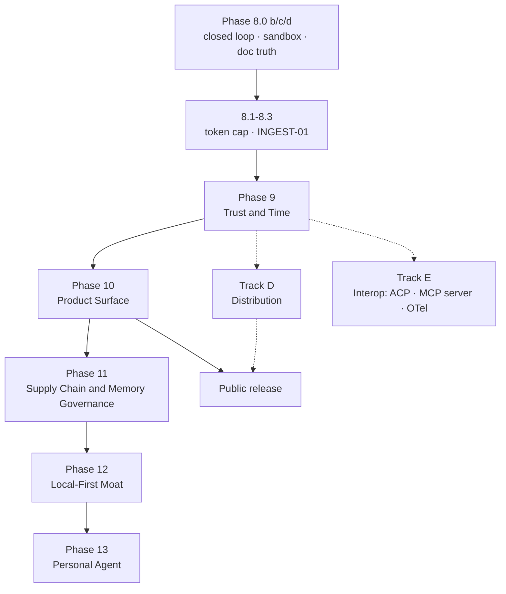

# AetherForge Roadmap — Phases 9–13 (Product Wedge)

**Baseline:** Phase 8.0 **closed** — Darwin **22/22 (22 hard / 0 soft)** on `main` @ `432ace9`, run
[`30565128737`](https://github.com/knarayanareddy/forge/actions/runs/30565128737). See
[PHASE_8_0_CLOSURE.md](./PHASE_8_0_CLOSURE.md). Phase 9 slices 9.7-9.8 (**UNDO-01**) and 9.9-9.10
(**LOOP-04**) have since merged, and Phase 10's **HOOK-01** (`PreToolUse` hook that blocks) and
**CKPT-01** (checkpoint + rewind) and Phase 11's **CONS-01** (consolidation apply/reject) have all
been implemented ahead of the rest of their respective phases, bringing the harness to 27 tasks —
all Linux-verified, next Darwin canonical run pending. A small non-numbered gap flagged during the
post-8.0 audit — `retrieve_session_memory` was wired into `run_stream_task` (8.0b) but not the
structured `nl:`-prefixed loop path — is also closed: `run_nl_loop_task_with_replan` now recalls
session memory before planning, fail-open on retrieval failure, the same way `run_stream_task`
already did.
**Canonical platform:** Darwin (macOS 15+ Apple Silicon)
**Binding spec:** Master roadmap. Each phase gets its own binding `ROADMAP_PHASE_N.md` **when it starts** — this document fixes scope, order, dependencies, and harness contracts.
**Prerequisite gate:** [Phase 8.0](./ROADMAP_PHASE_8.0.md) slices 8.0b–8.0d — **cleared**. Phase 9 slices 9.11+ may proceed.

---

## Executive Summary

Phases 1–8.0a built a **trustworthy substrate**: grants, audit hash chain, MCP pin verification, hybrid retrieval APIs, bi-temporal graph, and an authenticated IPC boundary. External critique scored the shipped product **~6.0** against a target-architecture score of **8.7–9.0**.

Phases 9–13 close that gap in dependency order, not wish order. The organising principle: **three critique buckets** — (**A**) category white space nobody ships, (**B**) table stakes every competitor ships, (**C**) half-built Forge assets worth finishing — are **interleaved by dependency**, because several A items require B Tier-0 primitives and several C items are prerequisites for A.

**Five bullets for stakeholders:**

1. **Phase 9 — Trust & Time.** Planner robustness (the real gap 8.0a exposed), replan-on-failure, JSONL session log as source of truth, run-level undo, cost/context accounting. Expensive-to-reverse decisions land here.
2. **Phase 10 — Product Surface.** Checkpoints/rewind, session fork, subagents, compaction, blocking hooks, permission modes with approval batching, user-addable MCP servers, headless JSON mode.
3. **Phase 11 — Supply Chain & Memory Governance.** Skill signing + capability manifests + injection scan, consolidation apply path, user-inspectable memory, secrets broker, untrusted-data boundary.
4. **Phase 12 — Local-First Moat.** Sleep-time memory compute, energy/thermal scheduler, per-model tool-call reliability scores, failure forensics. These are the differentiators no cloud product can match.
5. **Phase 13 — Personal Agent.** On-device Apple data connectors (Mail/Calendar/Contacts/Notes/Reminders/Files), voice, vision. The largest product-shaped hole in the category.

**Parallel tracks:** **D — Distribution** (signing, notarization, Sparkle) required before any public release. **E — Interop** (ACP, Forge-as-MCP-server, OpenTelemetry) so Forge composes into other harnesses instead of only competing with them.

---

## New Evidence — What 8.0a Actually Changed (and What It Revealed)

8.0a removed `LOOP02_GOLD_TOOL_ORDER` from `validate_nl_plan`. Verified by probe (`qwen2.5:3b`, 5 goals, `max_iterations = 8`):

| Goal | Before 8.0a | After 8.0a |
|------|-------------|------------|
| LOOP-02 eval prompt | OK (4 steps) | OK (4 steps) |
| "Create a README.md that says hello, then verify it." | OK (4 steps) | OK (4 steps) |
| "Read the file notes.txt and tell me what is in it." | `TrajectoryMismatch step 0: expected fs_write, got fs_read` | `ForbiddenPattern step 1: verify_contains requires non-empty text` |
| "Initialise a git repository on branch main…" | `Invalid step 0: missing field branch` | `Invalid step 0: missing field branch` |
| "List the files… using the filesystem MCP server." | `TrajectoryMismatch step 0` | `ForbiddenPattern step 1: verify_contains requires non-empty text` |

**Reading this honestly:** the eval-lock is gone — `fs_read` at step 0 now passes production validation (LOOP-03 probe green). But **3/5 ordinary goals still fail**, for different and now-visible reasons. 8.0a fixed the *dishonesty*; it did not fix the *capability*. Three root causes, all in production code:

1. **Prompt bias.** `build_nl_plan_prompt` still hardcodes the gold shape as its only example and instructs *"Emit exactly one verify_contains after each fs_write target"* — so a small model appends `verify_contains` even to read-only goals, then leaves `text` empty.
2. **No constrained decoding.** `git_init` arrives without its required `branch` field. Nothing enforces the schema at generation time; `serde_json::from_value` rejects it after the fact.
3. **No repair, no replan.** `run_nl_planner` is single-shot: validation error → hard fail. A validation error is exactly the signal a real agent loop would act on.

**Consequence for sequencing:** planner robustness is now the highest-value next slice, ahead of graph v2, MLX, and distribution. It is also the prerequisite for every A-bucket feature, because sleep-time compute, forensics, and reliability scoring all assume a loop that can recover.

---

## Reconciliation with Phase 8.1+

[ROADMAP_PHASE_8.md](./ROADMAP_PHASE_8.md) predates the critique. Recommended re-scope:

| Phase 8 slice | Disposition | Rationale |
|---------------|-------------|-----------|
| 8.1 loop default token cap (BUDG-01) | **Keep** — fold into Phase 9 cost accounting | Honesty item; cheap; COST-01 supersedes |
| 8.2–8.3 live ingest eval (INGEST-01) | **Keep as-is** | Depends on 8.0b; genuine anti-theater gate |
| 8.4–8.6 graph v2 (multi-hop, Leiden, decay) | **Defer to Phase 11** | Retrieval depth ranks below planner robustness and table stakes in user-visible value. Community summarization is the wrong shape for local token budgets — prefer dense-graph + path-ranking over Leiden rollups |
| 8.7 Kuzu adapter | **Defer indefinitely** | SQLite proven at 18/18; no measured bottleneck |
| 8.8 GATE-02 Telegram/Discord | **Defer to Phase 13+** | Gateway breadth is not the bottleneck; Slack mock + grant gate already proves the model |
| 8.9 model registry + HF downloader | **Promote into Phase 10** | Real user value (model management UI). Rename away from "MLX" framing |
| 8.10–8.11 direct MLX / GGUF runtime (MLX-01) | **Downgrade to optional** | **Ollama is now MLX-backed on Apple Silicon.** The original goal — "adapt the MacBook-optimised MLX architecture" — is substantially satisfied by tracking Ollama plus a model registry. Direct `mlx-rs`/`llama-cpp-2` becomes a power-user backend, not a phase headline |
| 8.12 signed DMG + notarize + Sparkle | **Promote to parallel Track D** | Blocking for release; independent of feature work; should not sit last behind graph/MLX |

**Net effect:** Phase 8 stops being a three-headed phase (distribution + graph + inference) and becomes a short honesty tail (8.1–8.3) feeding Phase 9.

---

## Traceability Matrix — Every A/B/C Item Mapped

### Bucket A — category white space

| # | Item | Phase | Harness |
|---|------|-------|---------|
| A1 | On-device Apple personal-data agent | 13 | APPLE-01 |
| A2 | Real reversibility (run-level undo across files/git/side effects) | 9 | UNDO-01 |
| A3 | Energy, thermal, battery accounting + local scheduler | 12 | ENERGY-01 *(probe)* |
| A4 | Per-model tool-calling reliability score | 12 | RELY-01 |
| A5 | Failure forensics + one-click regression case | 12 | FORENSIC-01 |
| A6 | Secrets brokering | 11 | SEC-01 |
| A7 | Approval batching with risk grouping | 10 | PERM-02 |
| A8 | User-readable/editable memory | 11 | MEM-03 *(probe)* |
| A9 | Untrusted-data boundary + cross-call correlation | 11 | INJECT-01 |
| A10 | Calibration / abstention | 12 | CAL-01 *(probe)* |
| A11 | Genuine offline degradation | 12 | OFFLINE-01 *(probe)* |
| A12 | Deterministic replay | 9 | SESS-01 |
| — | Sleep-time compute *(added: highest-leverage A item)* | 12 | SLEEP-01 |

### Bucket B — table stakes

| # | Item | Phase | Harness |
|---|------|-------|---------|
| B1 | Planner robustness (constrained decoding, neutral prompt, repair) | 9 | PLAN-01 |
| B2 | Replan / self-correction on verify failure | 9 | LOOP-04 |
| B3 | JSONL session log as source of truth | 9 | SESS-01 |
| B4 | Cost, token, context accounting + budgets | 9 | COST-01 *(probe)*, absorbs BUDG-01 |
| B5 | Prompt-prefix / KV-reuse stability | 9 | CACHE-01 *(probe)* |
| B6 | Checkpoints + rewind | 10 | CKPT-01 |
| B7 | Session resume / fork / side-branch | 10 | FORK-01 *(probe)* |
| B8 | Subagents with distilled returns | 10 | SUB-01 |
| B9 | Context compaction with thrashing guard | 10 | COMPACT-01 *(probe)* |
| B10 | Hooks that block (PreToolUse) | 10 | HOOK-01 |
| B11 | Permission modes | 10 | PERM-02 |
| B12 | Settings + model picker + BYOK UI | 10 | *(UI; absorbs 8.9 registry)* |
| B13 | User-addable MCP servers | 10 | MCP-02 *(probe)* |
| B14 | Headless JSON event mode | 10 | HEAD-01 *(probe)* |
| B15 | Interrupt vs steer | 10 | *(UI)* |
| B16 | Git worktree isolation | 10 | *(deferred to 10.x optional)* |
| B17 | `/doctor` self-diagnosis | 10 | *(UI)* |

### Bucket C — finish the half-built

| # | Existing asset | Finish into | Phase | Harness |
|---|----------------|-------------|-------|---------|
| C1 | `undo_journal` + `inverse_patch` (schema only; loop never writes to it) | Run-level undo | 9 | UNDO-01 |
| C2 | Hash-chained `audit_log` | Tamper-evident exportable activity log | 9 | *(extends SAFE-01)* |
| C3 | MCP SHA-256 + `tools_hash` pinning | Skill/plugin supply chain: signing, capability manifests, injection scan | 11 | SKILL-03 |
| C4 | `query_policy` table | Retrieval policy autotune per corpus | 11 | POLICY-01 *(probe)* |
| C5 *(implemented)* | `consolidation_runs` / `review_pending` gained `apply_consolidation_run`/`reject_consolidation_run` | Human-in-loop memory apply | 11 | CONS-01 |
| C6 | Seatbelt plumbing (FS-02 only) | Sandbox all tools + egress control | **8.0c** | *(extends FS-02)* |

---

## Dependency Graph

**Hard ordering constraints:**

- **9 before 10** — checkpoints, fork, and replay are all views over the Phase 9 session log. Building them first means building them twice.
- **9 before 12** — sleep-time compute, forensics, and reliability scoring all read trajectories from the session log and assume a loop that can replan.
- **11 before user-addable extensions ship publicly** — Phase 10 delivers `MCP-02` behind a trust flow, but skill/plugin marketplaces must not ship before C3 signing and injection scanning exist.
- **8.0c before Track D release** — do not distribute a signed binary whose agent loop runs tools unsandboxed.
- **Track D and E are parallel** — no feature dependency; only release depends on D.

---

## Phase 9 — Trust & Time

### Objective

Make the loop honest and time-travellable. Every downstream feature — checkpoints, fork, replay, forensics, sleep-time compute, eval — is a view over the artifacts this phase creates. These are the decisions that are expensive to reverse.

### Slices

| Slice | Scope | Ship signal | Harness |
|-------|-------|-------------|---------|
| **9.1** | Neutral planner prompt: remove gold-shape example and the "verify after every fs_write" instruction; per-tool few-shot; optional-field defaults | Read-only and git goals produce valid plans | prep |
| **9.2** | Constrained decoding: JSON-schema / grammar-constrained generation for plan and tool arguments (GBNF via Ollama options, or XGrammar in-process) | `git_init` never arrives without `branch` | prep |
| **9.3** | Repair loop: validation error → structured error back to model → bounded retry (cap 2) before hard fail | Malformed plan self-repairs | prep |
| **9.4** | **PLAN-01** harness: ≥10 frozen diverse goals (read-only, git, MCP, skill, multi-file, and 2 adversarial) — ≥90% produce executable plans | Planner works beyond eval shape | **+1 → 19** |
| **9.5** | `LoopEvent` → JSONL session log (append-only, one file per session, schema-versioned); daemon writes every plan/tool/observe/verify/error | Session reconstructable from disk | prep |
| **9.5-9.6 *(implemented)*** | `LoopStreamEvent` → JSONL session log (`aether-daemon::session_log`), append-only, schema-versioned, one file per session; `execute_structured_loop` centralizes every daemon execution path (`run_task`, automation triggers, gateway inbound) so all of them log a `TurnStart` plus every plan/tool/observe/verify/budget/done/error event, success or failure. **SESS-01** harness parses the log with no access to the live run and reconstructs the identical tool trajectory; asserts strictly increasing `seq`, pinned `schema_version`, a second turn appends without overwriting and increments `turn_index`, and a rejected plan's `Error` record is present | Log is a complete, order-preserving record of what actually ran | **+1 → 22 (implemented, ahead of the 9.7-9.13 slices below)** |
| **9.7-9.8 *(implemented, narrower scope)*** | `aether_permissions::journal_file_write`/`journal_git_init` wired into `ToolRegistry::execute` for `fs_write` and `git_init` (the only mutating tools that exist today — there is no `fs_delete`/`rename` tool to wire). `undo_pending_writes(session_id)` unwinds every still-`applied` journal row for the session, most recent first, restoring byte-identical prior content or deleting agent-created files; `git_init` is recorded as a marker and reported `not_undone` with a reason rather than reverted. **Scope narrower than originally planned:** this is session-scoped ("undo everything since the last undo"), not the `undo_run(run_id)` single-turn scoping the phrasing below implies — `undo_journal` has no run/turn column yet, and adding one is a documented follow-up, not a silent redefinition. **UNDO-01** harness proves multi-file + git run → byte-identical restore for every journaled write, idempotent on a second call, with the git mutation explicitly enumerated as non-undoable | Agent writes are journaled and reversible; non-undoable side effects are enumerated, not silently skipped | **+1 → 23 (implemented; Linux-verified, Darwin canonical run pending)** |
| **9.9-9.10 *(implemented)*** | `LoopError::VerifyFailed` (new variant) carries the failure plus observations-so-far out of `ReActLoopEngine::run_structured` instead of a plain `Turn` abort; `aether_daemon::task_runner::run_structured_with_replan` catches it, calls `run_nl_planner_repair` (a new NL-planner function analogous to the schema-repair loop but validated only for structural correctness, since a remediation plan is inherently partial) with the failed tool/detail/completed-steps fed back, and re-executes — bounded by [`MAX_LOOP_REPLANS`] = 2 and by the *shared* `max_iterations` budget (decremented by iterations already spent, not reset per attempt) so an unrecoverable goal fails cleanly instead of looping past budget. Each attempt gets its own session-log turn. **LOOP-04** harness: a frozen plan with a deliberately-wrong write fails `verify_contains` on the first attempt every time (fully deterministic); the replanned correction is checked across 5 isolated trials with a **60% minimum pass rate** (a 3B local model's exact correction is not 100% guaranteed — the mechanism is what's proven, not one lucky run — and a pass requires `replans >= 1`, so a first-try fluke cannot count), plus one fully deterministic case where the shared budget is exhausted by the first failure alone, proving a clean `MaxIterations` failure with an `Error` record in the session log and zero replan attempts (never calls the LLM once budget is gone) | Loop self-corrects, bounded by budget not luck | **+1 → 24 (implemented; Linux-verified, Darwin canonical run pending)** |
| **9.11** | Cost/context accounting: real token counts from provider (`eval_count` / `usage`), per-tool and per-run attribution, default non-zero `max_tokens` (absorbs 8.1 BUDG-01) | Budgets enforced; no unlimited default | **COST-01** *(probe)* |
| **9.12** | Prefix stability: static system+tools prefix at position 0, volatile state appended last, deterministic tool-result ordering; measure KV/cache reuse | Reuse rate instrumented | **CACHE-01** *(probe)* |
| **9.13** | Tamper-evident audit export (C2): signed export of `audit_log` with chain verification CLI | Export verifies after adversarial edit | extends SAFE-01 |

### Anti-theater

| Do NOT claim | Required proof |
|--------------|----------------|
| "NL planning works" | PLAN-01 ≥90% on ≥10 diverse goals — not the eval prompt plus one lookalike |
| "Session replay" | SESS-01 reconstructs the identical tool trajectory purely from the parsed log (deterministic structured plans stand in for "inference stubbed" here — no live run access, no re-execution) |
| "Undo shipped" | UNDO-01 restores pre-state; `bulk_rename_with_undo` demo path does not count |
| "Self-correcting agent" | LOOP-04 replan succeeds *and* unrecoverable case fails cleanly within budget |
| "Cost tracking" | Provider-reported tokens, not `len/4` estimates |

---

## Phase 10 — Product Surface

### Objective

Reach table stakes. Nothing here is novel; all of it is disqualifying by absence. Everything is a view over Phase 9 artifacts.

### Slices

| Slice | Scope | Harness |
|-------|-------|---------|
| **10.1 *(implemented, narrower scope)*** | `checkpoints` table (new, no migration) captures a session's undo-journal watermark (`aether_permissions::current_undo_watermark`) plus its session-log turn count. `create_checkpoint`/`rewind_to_checkpoint` (`aether-daemon::checkpoint`), exposed as daemon IPC methods, undo every journal entry recorded since the watermark (`undo_since`, a generalization of UNDO-01's `undo_pending_writes`) *and* truncate the session log back to the checkpoint's turn count in the same call — restoring files and the transcript together, as required. **Narrower than planned:** this is an explicit, caller-invoked checkpoint/rewind pair, not an automatic checkpoint taken before every single mutating tool call — `undo_journal` already gives that per-write granularity; a checkpoint is the coarser, named, rewindable-later point on top of it. Symlink/hardlink limits are whatever `ProductionSandbox`/`undo_journal` already impose (documented in `docs/SANDBOX.md`), not a new mechanism. **CKPT-01** harness: checkpoint after turn 1, two more turns, rewind removes exactly the post-checkpoint files and truncates the log to 1 turn; a turn after rewind resumes numbering at 2 (proof truncation is real on disk); a second rewind to the same checkpoint is safe and also discards work added after the first rewind; rewinding an unknown checkpoint id fails closed | **+1 → 26 (implemented; Linux-verified, Darwin canonical run pending — lands alongside HOOK-01 and CONS-01, see the scoreboard projection below for the combined total)** |
| **10.2** | Session resume / fork / ephemeral side-branch over the JSONL log | **FORK-01** *(probe)* |
| **10.3** | Subagent runtime: own context window, own budget, returns distilled summary (target ≤2k tokens) to parent | prep |
| **10.4** | **SUB-01**: read-heavy task delegated to subagent; parent context stays below threshold; result sufficient to complete task | **+1 → 24** |
| **10.5** | Compaction with steerable instructions + thrashing guard (bounded attempts, then explicit error) | **COMPACT-01** *(probe)* |
| **10.6** | Hook engine: SessionStart, UserPromptSubmit, PreToolUse, PostToolUse, PermissionRequest, PreCompact, SubagentStart, SessionEnd; actions = shell, HTTP, LLM prompt, subagent; hooks merge across sources | prep |
| **10.6 *(narrower scope, one hook only)*** / **10.7 *(implemented, out of order)*** | `aether_core::hooks::pre_tool_use_path_check` — a hard, non-overridable path denylist (`.env`, `id_rsa`/`id_ed25519`, `.ssh/`, `.git/config`, `.aws/credentials`/`config`) — wired into `ToolRegistry::execute`'s `fs_write`/`fs_read` arms, checked before the grant check. **Narrower than 10.6's full plan:** no hook *engine* (no `SessionStart`/`UserPromptSubmit`/`PostToolUse`/etc. lifecycle, no pluggable shell/HTTP/LLM actions, no merge-across-sources) — one concrete, always-on `PreToolUse` rule. **HOOK-01** harness: a plan that explicitly instructs writing/reading a denylisted path, in a workspace with an explicit unrestricted write grant, is still hard-blocked (both instruction and grant present, hook still wins, and the file is never created on disk); an ordinary path in the same workspace is unaffected | **+1 → 25 (implemented; Linux-verified, Darwin canonical run pending — lands alongside CKPT-01 and CONS-01, see the scoreboard projection below for the combined total)** |
| **10.8** | Permission modes (Manual / Accept-edits / Plan / Auto) + risk-tiered tool annotations + **approval batching** UI grouped by risk (A7) | prep |
| **10.9** | **PERM-02**: batched approval screen; zero side effects execute before approval; deletions and unseen-domain egress always require explicit confirm | **+1 → 30** |
| **10.10** | Model registry TOML + HF downloader + quantization picker + settings/BYOK UI (absorbs 8.9) | prep |
| **10.11** | User-addable MCP servers with trust flow: add by command or URL, pin on install, diff-on-update review, per-server context cost display | **MCP-02** *(probe)* |
| **10.12** | Headless mode: `--json` NDJSON event stream, one event per state change; exit codes | **HEAD-01** *(probe)* |
| **10.13** | Interrupt vs steer (correction without killing the running tool), context inspector, `/doctor` | *(UI)* |

**Optional 10.14:** git worktree isolation + best-of-N across models. Strong demo for BYOK; defer if Phase 10 is running long.

### Anti-theater

| Do NOT claim | Required proof |
|--------------|----------------|
| "Checkpoints" | CKPT-01 restores files *and* truncates session log consistently — **shipped**, but only as an explicit checkpoint/rewind call, not automatic-before-every-step |
| "Subagents" | SUB-01 measured parent-context saving, not a second loop call |
| "Hooks" | HOOK-01 blocks; log-only advisory does not count — **shipped** as one hard-coded `PreToolUse` path rule, not the full hook engine (10.6) |
| "Permission UX solved" | PERM-02 batching with zero pre-approval side effects |
| "Any MCP server works" | MCP-02 with pin + diff-on-update, not a hardcoded resolver |

---

## Phase 11 — Supply Chain & Memory Governance

### Objective

Make extensibility safe and memory accountable. This is the phase that lets a marketplace exist without repeating the npm-postinstall problem, and turns `review_pending` into an actual workflow.

### Slices

| Slice | Scope | Harness |
|-------|-------|---------|
| **11.1** | Skill/plugin capability manifests: declared filesystem, network, and tool requirements shown before install; enforced at runtime | prep |
| **11.2** | Signing + pin-on-install + diff-on-update for skills (extends MCP `tools_hash` pattern, C3) | prep |
| **11.3** | Static injection scanner: flag imperative instructions in skill bodies, tool descriptions, and parameter schemas | prep |
| **11.4** | **SKILL-03**: frozen poisoned-skill corpus (≥8 cases: hidden instruction in description, rug-pull on update, over-broad manifest, credential exfil step) — 0 escapes | **+1 → 27** |
| **11.5** | Secrets broker (A6): credentials injected at tool-invocation time, never in context; transcript and log redaction | prep |
| **11.6** | **SEC-01**: tool authenticates using a brokered secret; secret absent from context, session log, audit log, and crash dump | **+1 → 28** |
| **11.7** | Untrusted-data boundary: explicit delimiting of all tool output; per-session tool dependency graph | prep |
| **11.8** | **INJECT-01**: frozen corpus where tool *results* attempt to induce unplanned tool calls — cross-call correlation flags and blocks; extends RED-01 surface | **+1 → 29** |
| **11.9** | Consolidation apply (C5): `apply_consolidation_run(run_id)` in one transaction — `supersede_graph_node` + edge rewire + `review_pending → applied`; reject path too | prep |
| **11.10 *(implemented, out of order)*** | `Database::apply_consolidation_run` reads back the *persisted review artifact* (not a freshly recomputed diff, so post-review graph drift can't silently change what gets applied) and supersedes exactly that node set in one transaction; re-applying an already-`applied` run is idempotent (`Ok(0)`, not an error), but applying a `rejected` or unknown run is always a hard error so a stray call can never override an explicit human rejection. `reject_consolidation_run` mutates no node. **CONS-01** harness: preview → apply → active graph reflects supersession and ignores a node added after review; idempotent re-apply; reject leaves the graph untouched and permanently blocks apply; unknown run id fails closed. Implemented ahead of the rest of Phase 11 (SKILL-03, SEC-01, INJECT-01 not yet started) since it was the smallest fully-isolated slice, using only existing `aether-db` schema — no migration needed | **+1 → 26 (implemented; Linux-verified, Darwin canonical run pending — lands alongside CKPT-01, see the scoreboard projection below for the combined total)** |
| **11.11** | User-inspectable memory (A8): "what I know about you" view with provenance, per-fact edit and delete, export | **MEM-03** *(probe)* |
| **11.12** | Retrieval policy autotune (C4): tune `query_policy` weights against a local gold set; per-corpus profiles | **POLICY-01** *(probe)* |
| **11.13** | Graph depth (re-scoped from 8.4–8.6): bidirectional 1-hop first, then bounded multi-hop with path ranking. **No Leiden community summarization** — token budget incompatible with local inference | **GRAPH-02** *(gated on recall delta)* |

### Anti-theater

| Do NOT claim | Required proof |
|--------------|----------------|
| "Safe skill marketplace" | SKILL-03 0/8 escapes with signing + manifest enforcement |
| "Secrets never leak" | SEC-01 across context, session log, audit log, crash dump |
| "Injection defended" | INJECT-01 cross-call correlation blocks, not delimiters alone |
| "Consolidation workflow" | CONS-01 apply path in a transaction, plus reject and idempotent re-apply — **shipped** |
| "Graph v2" | GRAPH-02 recall delta over the GRAPH-01 baseline; hop depth alone is hop theater |

---

## Phase 12 — Local-First Moat

### Objective

Ship what only a local-first Mac app can. Everything here is either impossible or economically irrational for a cloud product.

### Slices

| Slice | Scope | Harness |
|-------|-------|---------|
| **12.1** | Sleep-time agent runtime: separate agent owning memory-edit tools, sharing memory blocks with the primary; primary loses direct memory-write tools; triggered on idle + AC power | prep |
| **12.2** | Background document ingestion into memory/graph in "anytime" fashion (partial results readable) | prep |
| **12.3** | **SLEEP-01**: held-out query set — recall@k after a sleep cycle exceeds no-sleep baseline by δ; primary-agent latency unchanged; zero unapproved writes outside memory tables | **+1 → 31** |
| **12.4** | Per-model tool-call reliability (A4): local BFCL-style suite per installed quantization; score surfaced in model picker | prep |
| **12.5** | **RELY-01**: reliability score computed for ≥2 quantizations of one model and correctly ranks them against a frozen tool-call set; picker reflects score | **+1 → 32** |
| **12.6** | Failure forensics (A5): trajectory classifier over session logs — wrong tool, context exhaustion, schema failure, missing grant, bad tool output — plus "add as regression case" | prep |
| **12.7** | **FORENSIC-01**: ≥12 frozen failed trajectories classified with ≥80% accuracy against human labels; generated regression case runs in harness | **+1 → 33** |
| **12.8** | Energy/thermal accounting + scheduler (A3): per-run joules estimate, thermal state awareness, defer heavy inference on battery, local↔cloud cost comparison in UI | **ENERGY-01** *(probe)* |
| **12.9** | Offline degradation (A11): airplane-mode matrix — every network-dependent path degrades with a clear message and no hang | **OFFLINE-01** *(probe)* |
| **12.10** | Calibration / abstention (A10): confidence signal on plans; ask-instead-of-guess threshold | **CAL-01** *(probe)* |

### Anti-theater

| Do NOT claim | Required proof |
|--------------|----------------|
| "Sleep-time compute" | SLEEP-01 measured recall delta; a background cron that rewrites nothing does not count |
| "We know which models tool-call" | RELY-01 ranks real quantizations, not spec-sheet claims |
| "Explains its failures" | FORENSIC-01 ≥80% against human labels on frozen trajectories |
| "Energy aware" | ENERGY-01 measured, not a static wattage table |

---

## Phase 13 — Personal Agent

### Objective

Close the largest product-shaped hole in the category: a competent agent over personal data that never leaves the machine.

### Slices

| Slice | Scope | Harness |
|-------|-------|---------|
| **13.1** | `PersonalDataGrant` capability type: per-source, per-scope (read/write), revocable, audited — reusing the `GatewayGrant`/`AutomationGrant` pattern | prep |
| **13.2** | Read-only connectors first: Calendar, Contacts, Reminders, Notes, local Files. TCC prompts surfaced in onboarding | prep |
| **13.3** | **APPLE-01**: grant-gated read of a seeded local calendar/contacts fixture — denied without grant + audited; with grant, entities land in memory/graph with provenance; zero writes | **+1 → 34** |
| **13.4** | Mail and Messages read (higher sensitivity: explicit separate grant, redaction defaults) | prep |
| **13.5** | Write-capable actions behind mandatory confirmation (create event, draft reply) — never auto-approved | prep |
| **13.6** | Voice input: local dictation via native speech or local Whisper | **VOICE-01** *(probe)* |
| **13.7** | Vision: screenshot understanding + document OCR via local vision model | **VISION-01** *(probe)* |
| **13.8** | macOS invocation surfaces: menu bar, Shortcuts, Services, URL scheme, notifications, Focus-mode awareness | *(UI)* |

### Anti-theater

| Do NOT claim | Required proof |
|--------------|----------------|
| "Personal data agent" | APPLE-01 grant gate + audit + provenance; a read that bypasses `PermissionManager` does not count |
| "Private by design" | No personal-data content in any cloud request unless BYOK explicitly enabled for that source, proven by test |
| "Computer use" | Not in scope — connectors first, screen last (see deferrals) |

---

## Parallel Track D — Distribution

Promoted out of Phase 8.12. **Blocking for any public release; independent of feature phases.**

| Slice | Scope | Gate |
|-------|-------|------|
| **D.1** | Developer ID signing, Hardened Runtime, entitlements; **inside-out signing** of the Rust core and every bundled helper (never `--deep`) | `codesign --verify --strict` |
| **D.2** | `notarytool` submission + staple **both** `.app` and `.dmg` | `spctl --assess --type execute` |
| **D.3** | Sparkle 2.x with EdDSA; vendor prebuilt `sign_update`; generate appcast **last**, from final bytes | Appcast fetch + signature verify |
| **D.4** | CI release job verifying signatures before README may claim "installable" | **DIST-01** artifact gate |

**Known traps to pre-solve:** EdDSA signature covers exact bytes — any re-zip after appcast generation silently breaks updates. `sign_update` lives in DerivedData unless vendored. `codesign` fails with `errSecInternalComponent` without Full Disk Access.

**Release precondition:** 8.0c (sandbox on all tool paths) + Phase 10 permission modes. Do not ship a signed binary that runs tools unsandboxed.

---

## Parallel Track E — Interop

Cheap, high-leverage, no feature dependency. Makes Forge composable rather than only competitive.

| Slice | Scope | Harness |
|-------|-------|---------|
| **E.1** | ACP agent mode via the Rust `agent-client-protocol` crate — drive Forge from Zed/JetBrains | **ACP-01** *(probe)* |
| **E.2** | ACP client mode — host other agents inside the SwiftUI app | *(optional)* |
| **E.3** | Forge as an MCP server over stdio — other harnesses call Forge | **MCPS-01** *(probe)* |
| **E.4** | OpenTelemetry GenAI semantic conventions: `execute_tool`, `invoke_agent_*`, `gen_ai.conversation.id`; content capture opt-in | **OTEL-01** *(probe)* |
| **E.5** | MCP `2026-07-28` migration: protocol version as per-request metadata, `server/discover`, MRTR, elicitation; keep `2025-11-25` working | prep |

---

## Explicitly Deferred

| Item | Rationale | Precondition to revisit |
|------|-----------|-------------------------|
| **Agent teams (peer messaging)** | High token cost; new failure modes (rubber-stamp verification, misrouting). Subagents + cross-model checker capture most value | SUB-01 green + measured need |
| **Leiden community summarization** | Token budgets incompatible with local inference | Local context budgets exceed 200k routinely |
| **Kuzu as graph backend** | No measured SQLite bottleneck | GRAPH-02 green + perf benchmark |
| **Computer use / screen control** | Connectors-first ladder; highest-risk surface | Phase 13 connectors green + security review |
| **Browser automation (Lightpanda)** | Unchanged from Phase 7/8 deferral | Browser grant + `sandbox_browser.sb` + RED-01 extension |
| **Own extension language** | Category converged on Markdown+frontmatter for knowledge, existing languages for code | Never |
| **Fleet orchestration** | Single-machine product | Multi-device sync demand |
| **LLM-as-judge** | Judge theater without calibration | 50-case human rubric frozen (FORENSIC-01 builds toward this) |
| **Direct MLX runtime as headline** | Ollama is MLX-backed; marginal gain small | Measured Ollama ceiling on target hardware |
| **Telegram/Discord production adapters** | Gateway breadth not the bottleneck | Phase 13+ |

---

## Scoreboard Projection

| Milestone | Harness | Notes |
|-----------|---------|-------|
| Phase 8.0a *(shipped)* | 18/18 | + LOOP-03, IPC-01 probes |
| Phase 9 slices 9.1–9.4 *(merged)* | 19/19 | + PLAN-01 |
| Phase 8.0b *(merged)* | 20/20 | + MEM-02 closed daemon memory loop |
| Phase 8.0c *(merged)* | 21/21 | + SB-01 production tool sandbox |
| Phase 9 slices 9.5–9.6 *(merged)* | 22/22 | + SESS-01 session log; also fixed a `GIT_CONFIG_NOSYSTEM` Seatbelt/git regression the first post-merge Darwin run of Phase 8.0c surfaced |
| **Phase 8.0 complete** | **22/22** | **Canonical Darwin verified** — run `30565128737` on `main` @ `432ace9` |
| Phase 9 slices 9.7–9.8 *(merged)* | 23/23 | + UNDO-01 (session-scoped `undo_pending_writes`; git_init enumerated non-undoable); Linux-verified, Darwin canonical run pending |
| Phase 9 slices 9.9–9.10 *(merged)* | 24/24 | + LOOP-04 (bounded replan on verify failure via `run_structured_with_replan`); Linux-verified, Darwin canonical run pending |
| Phase 10 slice 10.7 *(merged, out of order)* | 25/25 | + HOOK-01 (one hard-coded `PreToolUse` path-denylist rule, not the full hook engine); Linux-verified, Darwin canonical run pending. Landed ahead of the rest of Phase 10 |
| Phase 10 slice 10.1 *(merged, out of order)* | 26/26 | + CKPT-01 (`create_checkpoint`/`rewind_to_checkpoint`, explicit not automatic-per-step); Linux-verified, Darwin canonical run pending. Landed alongside HOOK-01 |
| Phase 11 slice 11.10 *(merged, out of order)* | 27/27 | + CONS-01 (`apply_consolidation_run`/`reject_consolidation_run`, applies exactly the persisted review artifact); Linux-verified, Darwin canonical run pending. Landed ahead of the rest of Phase 11 — smallest fully-isolated slice, no schema migration needed |
| Phase 8.1–8.3 | 28/28 | + INGEST-01 |
| **Phase 9 complete** | **28/28** | + INGEST-01 (UNDO-01, LOOP-04 already merged above) |
| **Phase 10 complete** | **30/30** | + SUB-01, PERM-02 (HOOK-01, CKPT-01 already merged above) |
| **Phase 11 complete** | **33/33** | + SKILL-03, SEC-01, INJECT-01 (CONS-01 already merged above) |
| **Phase 12 complete** | **36/36** | + SLEEP-01, RELY-01, FORENSIC-01 |
| **Phase 13 complete** | **37/37** | + APPLE-01 |

Probes (`COST-01`, `CACHE-01`, `FORK-01`, `COMPACT-01`, `MCP-02`, `HEAD-01`, `MEM-03`, `POLICY-01`, `ENERGY-01`, `OFFLINE-01`, `CAL-01`, `ACP-01`, `MCPS-01`, `OTEL-01`, `VOICE-01`, `VISION-01`) stay off the scoreboard until their invariant is enforced in production crate code — same promotion rule as LOOP-03/IPC-01 in Phase 8.0.

**Scoreboard discipline:** ≤5 new scoreboard tasks per phase. A 35-task suite that runs on every push is the ceiling; beyond that, tier into fast PR subset and nightly full matrix.

---

## Global Gates & Honesty Rules (Phases 9–13)

| Gate | Rule |
|------|------|
| **Hard green** | A task is **hard** only when production crate code enforces the invariant — not harness-only mocks. Unchanged from Phases 6–8. |
| **Regression lock** | Every prior task must PASS before a phase may be claimed complete. |
| **Probe promotion** | Probes join the scoreboard only when their invariant moves into production code. |
| **No product claims without Track D** | README may not say "installable" until DIST-01 verifies signatures. |
| **No marketplace before Phase 11** | User-installable skills/plugins ship only after SKILL-03 is green. |
| **Naming honesty** | `ReActLoopEngine::run_structured` itself is still a single-pass sequential executor; real replanning now lives one layer up in `aether_daemon::task_runner::run_structured_with_replan`, which re-invokes it per attempt. Consider renaming `ReActLoopEngine` once/if replanning moves inside the engine itself. Also drop `OllamaMlx` in favour of a backend enum that names what it does. |
| **Critique cadence** | Independent code-grounded audit at each phase boundary, in the Phase 8.0 pattern. |

---

## Success Metrics

| Metric | Target | Measurement |
|--------|--------|-------------|
| PLAN-01 diverse-goal success | ≥90% of ≥10 frozen goals | `plan01.rs` |
| LOOP-04 recovery | ≥60% self-correction pass rate across isolated trials (small local model, not claimed deterministic) with replan genuinely firing; 100% clean bounded failure once budget is exhausted | `loop04.rs` |
| SESS-01 replay determinism | log-reconstructed trajectory matches the live run's own observations | `sess01.rs` |
| UNDO-01 restoration | byte-identical pre-state; non-undoable effects enumerated | `undo01.rs` |
| SKILL-03 / INJECT-01 escape rate | 0% | frozen corpora |
| SEC-01 secret leakage | 0 occurrences across 4 sinks | `sec01.rs` |
| SLEEP-01 recall delta | ≥ baseline + δ on held-out queries | `sleep01.rs` |
| FORENSIC-01 accuracy | ≥80% vs human labels | `forensic01.rs` |
| Prompt-cache / KV reuse | >70% by turn 2 | CACHE-01 telemetry |
| Regression lock | 100% prior tasks PASS | `cargo run -p golden-harness` |

---

*Phases 9–13 master roadmap · derived from external code-grounded audit (2026-07-25) and post-8.0a probe evidence · per-phase binding specs to follow at phase start*
