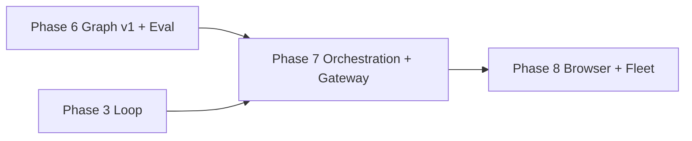

# AetherForge Roadmap — Phase 7

**Baseline:** Phase 6 complete — Darwin **15/15 harness (15 hard / 0 soft)**  
**Canonical platform:** Darwin (macOS 15+ Apple Silicon)  
**Linux CI:** fail-closed for FS-02, MEM-01, ROUT-01, GRAPH-01, LOOP-02 when `sandbox-exec` or Ollama absent  
**Binding spec:** This document is the Phase 7 contract. Every shipped claim maps to a harness task or an explicit deferral below.

---

## Phase 7 Executive Summary

Phase 7 adds an **orchestration layer**, not another memory megastack. Phase 6 proved structured memory (bi-temporal graph, ingest extract, eval hardening) improves retrieval and keeps the closed loop closed. Phase 7 extends that foundation with **event-driven automations**, a **maker-checker verifier node** in the execution graph, and an **OpenClaw-style gateway** (Slack/Telegram/Discord) — all gated by the existing permission and RED-01 adversarial model.

**Five bullets for stakeholders:**

1. **Automations (LangChain Loop 3 analog)** — cron/daemon triggers, file watchers, PR webhook hooks; deferred until RED-01 + GRAPH-01 green — **precondition now satisfied**.
2. **Maker-checker orchestration** — executor subagent node + separate verifier subagent node; verifier cannot mutate workspace; graph-engineering orchestration, not AutoGPT open loops.
3. **Gateway wedge** — inbound network grant model (RED-01 extended); Slack first, Telegram/Discord second; fail-closed without explicit channel grant.
4. **Harness grows 15 → 18–19 (all hard)** — AUTO-01 (automation trigger + audit), CHECK-01 (maker-checker deny on unverified write), GATE-01 (gateway grant + message round-trip mock).
5. **Explicit deferrals** — Lightpanda/browser MCP, fleet orchestration at scale, LLM-as-judge without calibration set, OmniRoute, anything-llm skips, graph viz UI.

---

## Global Gates & Honesty Rules (Phase 7)

These inherit Phases 1–6 gates and add Phase 7-specific rules.

| Gate | Rule |
|------|------|
| **Hard green** | New tasks (AUTO-01, CHECK-01, GATE-01) are **hard** only when production crate code enforces the invariant — not harness-only mocks without grant checks. |
| **README scoreboard** | README must show `X/N harness (Y hard)` — never claim 18/18 without `cargo run -p golden-harness` on Darwin with Ollama warm per ROUT pattern. |
| **Darwin canonical** | CHECK-01 and GATE-01 may require live Ollama for verifier NL checks; document flake honestly. |
| **Linux fail-closed** | Missing Ollama → explicit FAIL for CHECK-01 when verifier uses NL; GATE-01 mock may PASS without network. |
| **Regression lock** | All 15 Phase 1–6 tasks must remain PASS before claiming Phase 7 complete. |
| **No automation theater** | AUTO-01 green requires real trigger → daemon `run_task` → audit entry — not cron printf-only. |
| **No gateway theater** | GATE-01 requires grant gate before any inbound message reaches loop — not HTTP 200 echo. |
| **No maker-checker theater** | CHECK-01 requires verifier deny on unverified fs_write — not log-only advisory. |

---

## Phase 7 — Orchestration + Gateway + Automations

### Phase Goal & Thesis

Phase 7 proves that **bounded orchestration improves reliability** without reopening unverified autonomy. The thesis: a maker-checker split (executor plans and acts; verifier independently validates before side effects commit), plus explicit automation triggers and a network grant model for chat gateways, delivers trustworthy multi-surface agent access — frozen by CHECK-01 and GATE-01 before any fleet-scale or LLM-judge work is considered.

### Prerequisites

| Prerequisite | Evidence |
|--------------|----------|
| Phase 6 complete | Darwin **15/15 (15 hard / 0 soft)** — `cargo run -p golden-harness` |
| GRAPH-01 green | recall@3 on 5-query gold set |
| LOOP-02 green | NL plan through same verify shell as LOOP-01 |
| RED-01 green | ≥12 frozen adversarial cases; 0% escape (14 shipped) |
| Consolidate offline | `review_pending` until human apply — no auto-apply |
| Independent Phase 6 audit | Canvas + ROADMAP_PHASE_6.md checklist ticks |

**Do not start Phase 7 implementation until Phase 6 is pushed to `main` and independently audited.**

---

### Architecture Delta

```
Phase 6 (today)                         Phase 7 (target)
─────────────────                       ─────────────────

┌─────────────┐                         ┌─────────────┐
│  SwiftUI    │                         │  SwiftUI    │
│  App        │                         │  App        │
└──────┬──────┘                         └──────┬──────┘
       │ TCP                                   │ TCP
┌──────▼──────────────────────────┐    ┌──────▼──────────────────────────┐
│ aether-daemon                   │    │ aether-daemon                   │
│  run_task → ReActLoopEngine       │    │  run_task → OrchestrationGraph    │
│  + NL planner (LOOP-02)         │    │    ├─ ExecutorNode (maker)       │
│  + post_turn ingest             │    │    └─ VerifierNode (checker)     │
│                                 │    │  + AutomationScheduler           │
└──────┬──────────────────────────┘    │  + GatewayRouter (Slack/…)       │
       │                               └──────┬──────────────────────────┘
┌──────▼──────────────────────────┐            │
│ aether-db (graph + memory)      │    ┌──────▼──────────────────────────┐
└─────────────────────────────────┘    │ Triggers: cron · fswatch · PR hook │
                                       └──────────────────────────────────┘

Grant layers (unchanged + extended):
  FS / git / MCP / skill  → PermissionManager (Phase 1–5)
  Network inbound         → GatewayGrant (Phase 7, RED-01 extended)
  Automation run          → AutomationGrant + audit_log
  Verifier                → read-only + verify_contains; no fs_write without checker PASS
```

**Execution flow delta:**

```
Inbound (TCP | Slack | cron | PR webhook)
    ├─► Grant check (PermissionManager + GatewayGrant / AutomationGrant)
    ├─► OrchestrationGraph
    │     ├─► ExecutorNode: NlPlanner / JSON plan → tools
    │     └─► VerifierNode: re-read artifacts, lint, deny on mismatch
    ├─► ReActLoopEngine verify shell (unchanged invariant)
    └─► audit_log + optional post_turn ingest
```

---

### File / Crate Touch List (Projected)

| Path | Phase 7 change |
|------|----------------|
| `crates/aether-core/src/orchestration_graph.rs` *(new)* | Maker-checker DAG: executor + verifier nodes |
| `crates/aether-core/src/verifier_node.rs` *(new)* | Read-only verification; CHECK-01 surface |
| `crates/aether-daemon/src/automation.rs` *(new)* | Cron/file-watcher/PR trigger registry |
| `crates/aether-daemon/src/gateway/` *(new)* | Slack/Telegram/Discord adapters + grant gate |
| `crates/aether-permissions/src/lib.rs` | `GatewayGrant`, `AutomationGrant` capability types |
| `crates/aether-daemon/src/task_runner.rs` | Route through OrchestrationGraph when checker enabled |
| `tests/golden_harness/src/auto01.rs` *(new)* | AUTO-01 automation trigger + audit |
| `tests/golden_harness/src/check01.rs` *(new)* | CHECK-01 maker-checker deny |
| `tests/golden_harness/src/gate01.rs` *(new)* | GATE-01 gateway grant round-trip |
| `scripts/install-automation-hooks.sh` *(new)* | launchd/cron stub for Darwin |
| `profiles/sandbox_gateway.sb` *(new)* | Seatbelt for outbound Slack HTTPS (optional) |
| `docs/GATEWAY.md` *(new)* | Network grant model, channel setup |
| `docs/AUTOMATIONS.md` *(new)* | Trigger types, audit requirements |
| `docs/LINUX_CI.md` | Updated matrix for CHECK-01 fail-closed |
| `README.md` | Phase 7 status; N/N scoreboard when earned |

---

### Harness Tasks (Phase 7 Additions)

Full suite after Phase 7: **18 tasks minimum (18 hard)** on Darwin; target **19** if GATE-02 (second channel) ships.

| Task | Tier | Acceptance criteria | Evidence path |
|------|------|---------------------|---------------|
| **AUTO-01** | **hard** | Register frozen cron/file trigger → daemon receives `automation_run` → `run_task` executes LOOP-01 gold mini-plan → `audit_log` entry with `trigger_id`. Forbidden: trigger without `AutomationGrant`. | `tests/golden_harness/src/auto01.rs` |
| **CHECK-01** | **hard** | Executor proposes `fs_write`; verifier detects content mismatch vs goal → **deny** before write commits. 0/3 frozen bad plans may succeed. Verifier has no write grant. | `tests/golden_harness/src/check01.rs` |
| **GATE-01** | **hard** | Mock inbound Slack payload without `GatewayGrant` → **deny** + audit. With grant → message normalized → `run_task` → response artifact. No network in harness (localhost mock server). | `tests/golden_harness/src/gate01.rs` |

**Retained Phase 1–6 tasks (regression lock):** all 15 tasks — **hard**, unchanged tiers.

---

### Implementation Slices (Ordered, Vertical)

Each slice is independently shippable and must not break the 15-task regression lock until the final harness slice merges.

| Slice | Scope | Ship signal | Harness impact |
|-------|-------|-------------|----------------|
| **7.1** | Automation scheduler skeleton + `AutomationGrant` DDL | Cron tick → audit entry (no loop yet) | None |
| **7.2** | File watcher trigger + PR webhook stub | fswatch/HTTP POST → daemon enqueue | None |
| **7.3** | **AUTO-01** harness + frozen trigger fixtures | Trigger → run_task → audit | **+1 → 16/16** |
| **7.4** | `OrchestrationGraph` + `VerifierNode` scaffold | Executor/verifier split in production crate | None |
| **7.5** | Maker-checker wiring in `task_runner` | Unverified write blocked | None |
| **7.6** | **CHECK-01** harness + frozen bad-plan fixtures | 0/3 bad plans escape | **+1 → 17/17** |
| **7.7** | `GatewayGrant` + inbound message router | Grant gate before loop | None |
| **7.8** | Slack adapter (mock-first) + token Keychain | Channel config docs | None |
| **7.9** | **GATE-01** harness + mock Slack server | Grant deny/pass | **+1 → 18/18** |
| **7.10** | Docs + Linux CI + README scoreboard + Telegram stub | Phase 7 complete checklist | Final audit |

**Optional slice 7.11:** Telegram/Discord adapter parity (GATE-02) — defer if Slack path sufficient for MVP.

---

### Anti-Theater Checklist (What NOT to Claim Green)

| Do NOT claim | Because | Required proof |
|--------------|---------|----------------|
| "Automations shipped" | Cron printf ≠ agent run | AUTO-01 trigger → run_task → audit |
| "Maker-checker live" | Log advisory ≠ deny | CHECK-01 blocks unverified fs_write |
| "Slack gateway shipped" | Webhook echo ≠ grant gate | GATE-01 deny without GatewayGrant |
| "Multi-agent fleet" | Phase 7 = single executor + verifier | No fleet orchestration in Phase 7 |
| "LLM-as-judge" | No calibration set | Defer until 50-case human rubric |
| "Browser automation" | Lightpanda MCP + sandbox_browser.sb | Explicit Phase 8+ deferral |
| "18/18 on Linux" | CHECK-01 may need Ollama verifier | Linux matrix updated honestly |
| "Event loops at scale" | Fleet orchestration deferred | AUTO-01 single-trigger only |

---

### Success Metrics

| Metric | Target | Measurement |
|--------|--------|-------------|
| **Harness score (Darwin)** | **18/18 (18 hard / 0 soft)** | `cargo run -p golden-harness` |
| **Regression lock** | 15/15 Phase 1–6 tasks PASS | Same run |
| **CHECK-01 escape rate** | 0% (0/3 bad plans) | `check01.rs` |
| **GATE-01 grant deny** | 100% without grant | `gate01.rs` |
| **AUTO-01 audit trail** | 100% triggered runs logged | `auto01.rs` |
| **Shippable slices** | **10/10 slices** merge without breaking prior harness | Per-slice PR |
| **Ollama flake honesty** | ROUT warmup documented; CHECK-01 may fail cold | README + harness logs |

---

### Linux CI Expectations

| Task | Linux CI | Notes |
|------|----------|-------|
| Phase 1–6 retained | Unchanged | See [LINUX_CI.md](./LINUX_CI.md) |
| **AUTO-01** | PASS expected | Local mock trigger; no Ollama |
| **CHECK-01** | **FAIL-CLOSED** or PASS | FAIL if verifier uses Ollama NL; PASS if rule-based verifier |
| **GATE-01** | PASS expected | localhost mock; no real Slack |

**Expected Linux score:** 11–12/18 depending on CHECK-01 verifier mode. Document in `docs/LINUX_CI.md`.

**PR subset (fast path):** extend Phase 6 eight to include AUTO-01 + GATE-01 (grant checks, no Ollama).

**Nightly / Darwin gate:** full 18/18.

---

### Checks & Balances

- **Must NOT regress:** All 15 Phase 1–6 harness tasks.
- **Audit gate:** Gateway cannot bypass `PermissionManager` or write grants.
- **Audit gate:** Verifier node has **no** fs_write/git/mcp grants — read + verify only.
- **Audit gate:** Automation triggers require explicit `AutomationGrant` per trigger_id.
- **Honesty:** CHECK-01 fail closed when Ollama offline if NL verifier — same rule as LOOP-02.
- **Honesty:** No real Slack/Telegram tokens in harness — mock server only.

---

### Regression Lock

FS-01, FS-02, GIT-01, CODE-01, ROUT-01, MCP-01, MEM-01, GRAPH-01, SKILL-01, SKILL-02, SAFE-01, RED-01, RES-01, LOOP-01, LOOP-02, **AUTO-01**, **CHECK-01**, **GATE-01**.

---

### Definition of Done

- Harness: **18/18 (18 hard)** on Darwin with Ollama running and ROUT warmup.
- README shows Phase 7 status and accurate scoreboard.
- `docs/GATEWAY.md` documents network grant model.
- `docs/AUTOMATIONS.md` documents trigger types and audit requirements.
- `docs/LINUX_CI.md` updated with CHECK-01 fail-closed row.
- Independent audit checklist below passes.
- Commits pushed to `main`.

---

### Dependencies

| Dependency | Phase |
|------------|-------|
| Phase 6 complete (15/15 harness, graph v1, RED-01, LOOP-02) | Phase 6 |
| `ReActLoopEngine` + verify shell | Phase 3 |
| RED-01 adversarial model (extends to gateway) | Phase 6 |
| Keychain BYOK pattern (gateway tokens) | Phase 5 |
| Daemon TCP IPC | Phase 1 |

---

### Explicitly Deferred (Phase 7 doc — not in scope)

| Item | Deferral rationale | Precondition to revisit |
|------|-------------------|-------------------------|
| **Lightpanda / browser MCP** | Requires browser grant + `sandbox_browser.sb` | GATE-01 green + security review |
| **Event-driven loops at fleet scale** | Orchestration complexity | CHECK-01 green 30 days |
| **Fleet orchestration** | Multi-session coordinator not MVP | Phase 8 |
| **LLM-as-judge** | Judge theater without calibration | 50-case human rubric frozen |
| **OmniRoute** | Out of scope | N/A |
| **anything-llm skips** | Out of scope | N/A |
| **Graph visualization UI** | Graph theater without query eval | GRAPH-01 already green; UI Phase 8+ |
| **Full GraphRAG / Graphiti** | Scope explosion | Graph v1 metrics plateau |
| **Shadow run / A/B prod** | No prod fleet | Daemon log-only mode |
| **Direct MLX / llama.cpp runtime** | Unchanged deferral | Phase 8+ |
| **Telegram/Discord production** | Slack-first wedge | GATE-01 green (optional 7.11) |

---

### Risk / Rollback

| Risk | Mitigation |
|------|------------|
| Verifier false positives block legit writes | Frozen CHECK-01 gold; tunable strictness; audit appeal path |
| Gateway token leak | Keychain storage; grant scoped per channel; RED-01 extended |
| Automation runaway | Reuse LoopConfig budgets; max automations per session |
| Slack API drift | Mock-first harness; adapter version pin |
| Orchestration graph complexity | Two-node MVP only (executor + verifier) |

**Rollback:** Revert Phase 7 commits; harness returns to **15/15** at Phase 6 tag `8ed54be`.

---

### Relationship to v1.2.4 Backlog

| v1.2.4 §6 Backlog item | Phase 7 disposition |
|------------------------|---------------------|
| Full Loop engine (`/loop`, `/goal`, maker-checker) | **Addressed** — CHECK-01 + OrchestrationGraph |
| OpenClaw-style gateway | **Addressed** — GATE-01 Slack-first |
| Scheduled automations / cron | **Addressed** — AUTO-01 |
| GraphRAG megastack | Still deferred |
| macOS installable app (DMG) | Phase 5 delivered; no regression |
| BYOK Keychain | Extended to gateway tokens |

v1.2.5 canonical spec patch should incorporate Phase 6 memory architecture ([GRAPH_V1.md](./GRAPH_V1.md)) and Phase 7 orchestration deltas from this roadmap — not before Phase 7 audit passes.

---

### Independent Audit Checklist (Phase 7 — pre-ship)

- [ ] `OrchestrationGraph` in production crate, not harness-only
- [ ] `VerifierNode` has no write grants in PermissionManager tests
- [ ] AUTO-01 uses production automation enqueue path
- [ ] CHECK-01 blocks ≥1 frozen bad plan via verifier deny
- [ ] GATE-01 denies inbound without GatewayGrant
- [ ] README scoreboard matches `cargo run -p golden-harness` on Darwin
- [ ] Linux CI docs list CHECK-01 fail-closed when applicable
- [ ] Phase 1–6 tasks still PASS (regression lock)
- [ ] No real Slack/Telegram secrets in repo or harness

---

## Phase Dependency Graph (Updated)



---

## Scoreboard History (Projected)

| Milestone | Harness | Hard | Soft | Notes |
|-----------|---------|------|------|-------|
| Phase 6 complete | 15/15 | 15 | 0 | Graph v1, RED-01, LOOP-02, SKILL-02 |
| Phase 7 slice 7.3 | 16/16 | 16 | 0 | +AUTO-01 |
| Phase 7 slice 7.6 | 17/17 | 17 | 0 | +CHECK-01 |
| **Phase 7 complete** | **18/18** | **18** | **0** | +GATE-01 |

---

*Phase 7 binding spec · synthesized from Phase 6 completion audit + orchestration/gateway research · 2026-07-25*
