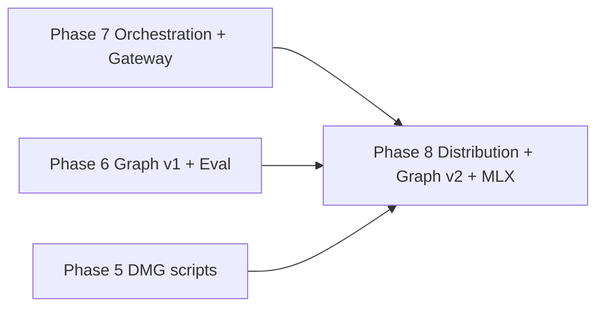

# AetherForge Roadmap — Phase 8

**Baseline:** Phase 7 complete — Darwin **18/18 harness (18 hard / 0 soft)** · slice 7.10 docs/CI closure @ `91bfc01`  
**Canonical platform:** Darwin (macOS 15+ Apple Silicon)  
**Linux CI:** fail-closed for FS-02, MEM-01, ROUT-01, GRAPH-01, LOOP-02 when `sandbox-exec` or Ollama absent  
**Binding spec:** This document is the Phase 8 contract. Every shipped claim maps to a harness task or an explicit deferral below. **Planning only — no implementation in this document.**

---

## Phase 8 Executive Summary

Phase 8 closes the **distribution gap**, upgrades **graph memory to v2**, and adds **direct MLX / llama.cpp inference** — without reopening unverified autonomy. Phase 7 proved bounded orchestration (maker-checker, automations, gateway grant model) on an 18/18 harness. Phase 8 makes AetherForge **installable at consumer grade**, **retrievable beyond 1-hop**, and **runnable without Ollama as the only LLM wedge** — while absorbing meta-critique backlog items (live ingest eval, loop token cap default, GATE-02, browser grant preconditions).

**Five bullets for stakeholders:**

1. **Signed DMG release pipeline** — `codesign --deep`, Apple notarization + stapling, Homebrew cask, Sparkle auto-updater; replaces script-only `create-dmg.sh` / `notarize.sh` with CI-enforced release artifacts.
2. **Graph v2 query wedge** — multi-hop traversal (>1), Leiden community detection, hierarchical summaries, decay/recency weighting; optional Kuzu backend behind feature flag; no force-directed viz theater.
3. **Direct MLX runtime** — hf-hub model downloader, `llama-cpp-2` GGUF path, `mlx-rs` sidecar for Apple Silicon, model registry TOML, `mlx-vlm` vision hook, quantization picker in SwiftUI.
4. **Harness grows 18 → 22–24 (mostly hard)** — PKG-01 (signed artifact verify), GRAPH-02 (multi-hop recall@k), INGEST-01 (live Ollama extract eval), MLX-01 (load + TTFT on registered model), GATE-02 (Telegram/Discord production adapters mock).
5. **Explicit deferrals** — fleet orchestration at scale, LLM-as-judge without calibration set, Lightpanda/browser MCP (until browser grant + security review), OmniRoute, graph viz UI, shadow/A/B prod.

---

## Global Gates & Honesty Rules (Phase 8)

These inherit Phases 1–7 gates and add Phase 8-specific rules.

| Gate | Rule |
|------|------|
| **Hard green** | New tasks (PKG-01, GRAPH-02, INGEST-01, MLX-01, GATE-02) are **hard** only when production crate code enforces the invariant — not harness-only mocks without grant checks. |
| **README scoreboard** | README must show `X/N harness (Y hard)` — never claim 22+/N without `cargo run -p golden-harness` on Darwin with Ollama warm per ROUT pattern. |
| **Darwin canonical** | PKG-01, MLX-01, Sparkle require macOS codesign + Apple Silicon; document Linux skip honestly. |
| **Linux fail-closed** | PKG-01, MLX-01 **FAIL-CLOSED** on Linux; GRAPH-02 may PASS with fixture graph (no Ollama if rule-based extract seed allowed — prefer live INGEST-01 on Darwin only). |
| **Regression lock** | All 18 Phase 1–7 tasks must remain PASS before claiming Phase 8 complete. |
| **No DMG theater** | PKG-01 green requires verified codesign + notarization stapled artifact — not unsigned `create-dmg.sh` output. |
| **No graph v2 theater** | GRAPH-02 requires recall@k improvement on frozen gold set with hop>1 — not edge-count dashboards. |
| **No MLX theater** | MLX-01 requires load + inference on registry-pinned model with TTFT gate — not import-only stub. |
| **Loop budget honesty** | Slice 8.11 sets daemon default `max_tokens` > 0; document migration from Phase 7 unlimited default. |

---

## Phase 8 — Distribution + Graph v2 + Direct MLX

### Phase Goal & Thesis

Phase 8 proves that AetherForge can ship as a **consumer-grade macOS product**, retrieve with **multi-hop graph signal**, and run **native Apple Silicon inference** — without bypassing the permission, maker-checker, and RED-01 adversarial model. The thesis: signed/notarized distribution + Sparkle updates remove install friction; graph v2 multi-hop + decay weighting measurably beats 1-hop RRF on GRAPH-02; direct MLX/llama.cpp backends reduce Ollama single-point dependency while ROUT-01/MLX-01 TTFT gates keep latency honest.

### Prerequisites

| Prerequisite | Evidence |
|--------------|----------|
| Phase 7 complete | Darwin **18/18 (18 hard / 0 soft)** — `cargo run -p golden-harness` @ `91bfc01` |
| AUTO-01 green | Trigger → run_task → audit |
| CHECK-01 green | Verifier deny on bad plans; no write grant |
| GATE-01 green | GatewayGrant deny/pass on mock Slack |
| Independent Phase 7 audit | Canvas + ROADMAP_PHASE_7.md checklist ticks |
| Apple Developer ID | Required for PKG-01 (Team ID in CI secrets) |

**Do not start Phase 8 implementation until Phase 7 is pushed to `main` and independently audited.**

---

### Architecture Delta

```
Phase 7 (today)                         Phase 8 (target)
─────────────────                       ─────────────────

┌─────────────┐                         ┌─────────────┐
│  SwiftUI    │                         │  SwiftUI    │
│  App        │                         │  + Sparkle  │
│             │                         │  + quant UI │
└──────┬──────┘                         └──────┬──────┘
       │ TCP                                   │ TCP
┌──────▼──────────────────────────┐    ┌──────▼──────────────────────────┐
│ aether-daemon                   │    │ aether-daemon                   │
│  OrchestrationGraph             │    │  OrchestrationGraph (unchanged)   │
│  AutomationScheduler            │    │  + ModelRegistry (TOML)         │
│  GatewayRouter (Slack mock)     │    │  + InferenceRouter              │
│  Ollama-only LLM                │    │     ├─ Ollama (retained)        │
└──────┬──────────────────────────┘    │     ├─ llama-cpp-2 GGUF         │
       │                               │     └─ mlx-rs sidecar (ARM64)   │
┌──────▼──────────────────────────┐    └──────┬──────────────────────────┘
│ aether-db graph v1              │    ┌──────▼──────────────────────────┐
│  1-hop RRF                      │    │ aether-db graph v2              │
└─────────────────────────────────┘    │  multi-hop · decay · Leiden     │
                                       │  optional Kuzu feature flag       │
                                       └─────────────────────────────────┘

Release pipeline (new):
  codesign --deep → notarytool → stapler → DMG → Homebrew cask → Sparkle appcast
```

**Inference routing delta:**

```
run_task / NlPlanner / graph_extract
    ├─► ModelRegistry.resolve(model_id) from config/models.toml
    ├─► Backend dispatch:
    │     ├─► ollama://  (existing)
    │     ├─► gguf://    (llama-cpp-2)
    │     └─► mlx://     (mlx-rs sidecar IPC)
    └─► ROUT-01 / MLX-01 TTFT gates per backend
```

**Graph query delta:**

```
search_hybrid_with_graph(query, hop=1)     →  search_graph_v2(query, max_hops≥2)
    + RRF memory                              + decay/recency edge weights
    + 1-hop entity expansion                    + Leiden community summaries
                                              + optional Kuzu Cypher (feature flag)
```

---

### File / Crate Touch List (Projected)

| Path | Phase 8 change |
|------|----------------|
| `scripts/create-dmg.sh` | Harden: codesign --deep, entitlements plist |
| `scripts/notarize.sh` | CI-wired notarytool + stapler |
| `scripts/release.sh` *(new)* | End-to-end sign → notarize → DMG → cask bump |
| `packaging/Homebrew/aetherforge.rb` *(new)* | Cask formula with sha256 + appcast |
| `apps/AetherForge/Sparkle/` *(new)* | SUUpdater delegate + appcast URL |
| `config/models.toml` *(new)* | Model registry: id, backend, path, quant, vision |
| `crates/aether-core/src/model_registry.rs` *(new)* | TOML loader + backend enum |
| `crates/aether-core/src/inference/` *(new)* | Ollama / llama-cpp-2 / mlx-rs adapters |
| `crates/aether-core/src/hf_hub.rs` *(new)* | hf-hub downloader with sha256 pin |
| `crates/aether-db/src/graph_v2.rs` *(new)* | Multi-hop, decay, Leiden summaries |
| `crates/aether-db/src/kuzu.rs` *(new, optional)* | Feature-gated Kuzu adapter |
| `tests/golden_harness/src/pkg01.rs` *(new)* | PKG-01 signed artifact verify |
| `tests/golden_harness/src/graph02.rs` *(new)* | GRAPH-02 multi-hop recall@k |
| `tests/golden_harness/src/ingest01.rs` *(new)* | INGEST-01 live Ollama extract eval |
| `tests/golden_harness/src/mlx01.rs` *(new)* | MLX-01 load + TTFT |
| `tests/golden_harness/src/gate02.rs` *(new)* | GATE-02 Telegram/Discord mock |
| `docs/RELEASE.md` *(new)* | Sign/notarize/cask/Sparkle runbook |
| `docs/GRAPH_V2.md` *(new)* | Multi-hop query contract |
| `docs/MODELS.md` *(new)* | Registry TOML + quantization guide |
| `profiles/sandbox_browser.sb` *(new)* | Browser grant Seatbelt (precondition only) |
| `docs/LINUX_CI.md` | Updated matrix for PKG-01, MLX-01 fail-closed |

---

### Harness Tasks (Phase 8 Additions)

Full suite after Phase 8: **22–24 tasks** on Darwin; exact count fixed at slice 8.12 merge.

| Task | Tier | Acceptance criteria | Evidence path |
|------|------|---------------------|---------------|
| **PKG-01** | **hard** | Built DMG passes `codesign --verify --deep --strict` + `spctl --assess --type open`; stapler validate when notarized in CI. | `tests/golden_harness/src/pkg01.rs` |
| **GRAPH-02** | **hard** | Multi-hop (≥2) recall@3 on frozen gold set beats 1-hop baseline on ≥3/5 queries; decay weight applied. | `tests/golden_harness/src/graph02.rs` |
| **INGEST-01** | **hard** | Live Ollama `graph_extract` on frozen turn fixture → valid schema → insert → retrievable entity (not extract_json seed). | `tests/golden_harness/src/ingest01.rs` |
| **MLX-01** | **hard** | Registry model loads via mlx-rs or llama-cpp-2; TTFT median ≤ ROUT threshold on warm run; inference produces non-empty completion. | `tests/golden_harness/src/mlx01.rs` |
| **GATE-02** | **hard** | Mock Telegram + Discord inbound without `GatewayGrant` → deny + audit; with grant → normalized prompt → run_task. | `tests/golden_harness/src/gate02.rs` |

**Retained Phase 1–7 tasks (regression lock):** all 18 tasks — **hard**, unchanged tiers.

---

### Implementation Slices (Ordered, Vertical)

Each slice is independently shippable and must not break the 18-task regression lock until the final harness slice merges.

| Slice | Scope | Ship signal | Harness impact |
|-------|-------|-------------|----------------|
| **8.1** | `codesign --deep` + entitlements in create-dmg.sh | Local signed .app verifies | None |
| **8.2** | Notarization CI job + stapler | Notarized DMG in artifact store | None |
| **8.3** | Homebrew cask + release.sh | `brew install --cask aetherforge` works | None |
| **8.4** | Sparkle appcast + auto-update | Delta update from N-1 → N | None |
| **8.5** | **PKG-01** harness | Signed artifact gate | **+1 → 19/19** |
| **8.6** | Graph v2 multi-hop + decay/recency | `search_graph_v2` in aether-db | None |
| **8.7** | Leiden communities + hierarchical summaries | Offline job + query boost | None |
| **8.8** | **GRAPH-02** harness + gold query set v2 | Multi-hop recall@k | **+1 → 20/20** |
| **8.9** | hf-hub downloader + `config/models.toml` registry | Pinned model fetch | None |
| **8.10** | llama-cpp-2 GGUF + mlx-rs sidecar backends | InferenceRouter dispatch | None |
| **8.11** | **MLX-01** harness + quantization picker UI + loop token cap default | Native inference TTFT gate; `DEFAULT_MAX_LOOP_TOKENS > 0` | **+1 → 21/21** |
| **8.12** | **INGEST-01** + **GATE-02** + optional Kuzu flag + docs/CI closure | Live extract eval; Telegram/Discord harness; Phase 8 complete | **+2–3 → 22–24/22–24** |

**Optional slice 8.13:** Kuzu backend production path — defer if SQLite multi-hop satisfies GRAPH-02.

**Optional slice 8.14:** `mlx-vlm` vision hook for screenshot ingest — defer if MLX-01 text-only sufficient.

---

### Meta-Critique Backlog (Absorbed)

| Backlog item | Phase 8 slice | Notes |
|--------------|---------------|-------|
| Live Ollama ingest eval (beyond fixture seed) | 8.12 INGEST-01 | Complements GRAPH-01 frozen seed honesty |
| Loop default token cap (not unlimited) | 8.11 | Change `DEFAULT_MAX_LOOP_TOKENS` from 0; migration note in README |
| GATE-02 Telegram/Discord production adapters | 8.12 | Builds on Phase 7 parse stubs in `gateway/telegram.rs`, `discord.rs` |
| Browser grant + Lightpanda deferral preconditions | 8.12 (precondition only) | Ship `sandbox_browser.sb` + grant type; **no** Lightpanda harness task in Phase 8 |

---

### Anti-Theater Checklist (What NOT to Claim Green)

| Do NOT claim | Because | Required proof |
|--------------|---------|----------------|
| "Consumer-ready DMG" | Unsigned drag-drop ≠ notarized release | PKG-01 codesign + spctl pass |
| "Graph v2 shipped" | Hop=2 SQL loop ≠ recall gain | GRAPH-02 beats 1-hop on gold set |
| "MLX native inference" | Sidecar spawn ≠ TTFT gate | MLX-01 warm median ≤ threshold |
| "Ingest extract proven" | Fixture seed ≠ live Ollama | INGEST-01 end-to-end extract |
| "Telegram/Discord live" | Parse stub ≠ grant gate harness | GATE-02 deny/pass |
| "Browser automation" | Lightpanda without grant review | Explicit Phase 9+ deferral |
| "22/22 on Linux" | PKG-01, MLX-01 Darwin-only | Linux matrix updated honestly |
| "Kuzu production" | Optional flag ≠ default path | GRAPH-02 must pass on SQLite v2 first |

---

### Success Metrics

| Metric | Target | Measurement |
|--------|--------|-------------|
| **Harness score (Darwin)** | **22–24/22–24 (mostly hard)** | `cargo run -p golden-harness` |
| **Regression lock** | 18/18 Phase 1–7 tasks PASS | Same run |
| **GRAPH-02 recall lift** | ≥3/5 queries improve vs hop=1 | `graph02.rs` |
| **PKG-01 verify** | 100% codesign + spctl on release DMG | `pkg01.rs` |
| **MLX-01 TTFT** | Median warm ≤ 200ms (or backend-specific threshold) | `mlx01.rs` |
| **INGEST-01 extract validity** | 100% schema-valid on frozen turns | `ingest01.rs` |
| **Loop token default** | `max_tokens > 0` in daemon default config | Unit test + README |
| **Shippable slices** | **12/12 core slices** merge without breaking prior harness | Per-slice PR |

---

### Linux CI Expectations

| Task | Linux CI | Notes |
|------|----------|-------|
| Phase 1–7 retained | Unchanged | See [LINUX_CI.md](./LINUX_CI.md) |
| **PKG-01** | **FAIL-CLOSED** | Requires macOS codesign + notarization |
| **GRAPH-02** | PASS expected | Fixture graph; no Ollama if seeded |
| **INGEST-01** | **FAIL-CLOSED** | Requires live Ollama extract |
| **MLX-01** | **FAIL-CLOSED** | Requires Apple Silicon + mlx-rs |
| **GATE-02** | PASS expected | localhost mock; no real Telegram/Discord |
| **AUTO-01, CHECK-01, GATE-01** | PASS | Unchanged from Phase 7 |

**Expected Linux score:** 15–16/22–24 depending on INGEST-01 and MLX-01 fail-closed. Document in `docs/LINUX_CI.md`.

**PR subset (fast path):** extend Phase 7 eleven to include GRAPH-02 + GATE-02 (grant checks, no Ollama/MLX).

**Nightly / Darwin gate:** full 22–24/22–24.

---

### Checks & Balances

- **Must NOT regress:** All 18 Phase 1–7 harness tasks.
- **Audit gate:** Sparkle update channel must serve stapled, signed builds only.
- **Audit gate:** Model registry pins sha256; no auto-pull unverified weights.
- **Audit gate:** mlx-rs sidecar runs with deny-default Seatbelt (reuse sandbox patterns).
- **Audit gate:** GATE-02 extends RED-01 adversarial model to Telegram/Discord surfaces.
- **Honesty:** INGEST-01 fail closed when Ollama offline — same rule as LOOP-02.
- **Honesty:** Browser grant type ships without Lightpanda until security review complete.

---

### Regression Lock

FS-01, FS-02, GIT-01, CODE-01, ROUT-01, MCP-01, MEM-01, GRAPH-01, SKILL-01, SKILL-02, SAFE-01, RED-01, RES-01, LOOP-01, LOOP-02, AUTO-01, CHECK-01, GATE-01, **PKG-01**, **GRAPH-02**, **INGEST-01**, **MLX-01**, **GATE-02**.

---

### Definition of Done

- Harness: **22–24/22–24 (mostly hard)** on Darwin with Ollama running and ROUT warmup.
- README shows Phase 8 status and accurate scoreboard.
- `docs/RELEASE.md` documents sign → notarize → cask → Sparkle pipeline.
- `docs/GRAPH_V2.md` documents multi-hop query contract.
- `docs/MODELS.md` documents registry TOML and quantization.
- `docs/LINUX_CI.md` updated with PKG-01, MLX-01, INGEST-01 fail-closed rows.
- Independent audit checklist below passes.
- Commits pushed to `main`.

---

### Dependencies

| Dependency | Phase |
|------------|-------|
| Phase 7 complete (18/18 harness, orchestration, gateway, automations) | Phase 7 |
| Apple Developer ID + notarytool credentials | External |
| `OrchestrationGraph` + grant model | Phase 7 |
| Graph v1 + GRAPH-01 gold set | Phase 6 |
| hf-hub, llama-cpp-2, mlx-rs crates | External (version-pinned) |

---

### Explicitly Deferred (Phase 8 doc — not in scope)

| Item | Deferral rationale | Precondition to revisit |
|------|-------------------|-------------------------|
| **Lightpanda / browser MCP** | Requires browser grant + security review | `sandbox_browser.sb` + RED-01 extension |
| **Fleet orchestration at scale** | Multi-session coordinator not MVP | CHECK-01 green 30 days post-Phase 7 |
| **LLM-as-judge** | Judge theater without calibration | 50-case human rubric frozen |
| **OmniRoute** | Out of scope | N/A |
| **Graph visualization UI** | Graph theater without query eval | GRAPH-02 green |
| **Full GraphRAG / Graphiti** | Scope explosion | Graph v2 metrics plateau |
| **Shadow run / A/B prod** | No prod fleet | Daemon log-only mode |
| **Kuzu production default** | Optional adapter only | GRAPH-02 plateau on SQLite |
| **mlx-vlm vision in harness** | Vision eval set not frozen | MLX-01 text green |

---

### Risk / Rollback

| Risk | Mitigation |
|------|------------|
| Notarization CI flake | Retry stapler; cache signed .app before DMG |
| MLX sidecar crash | Fallback to Ollama in InferenceRouter |
| Graph v2 recall regression | GRAPH-02 gold set v2; hop=1 parity test retained |
| Sparkle supply chain | EdDSA key in Keychain; appcast HTTPS pin |
| Token cap breaks existing workflows | Opt-out env `AETHER_MAX_TOKENS=0`; migration doc |

**Rollback:** Revert Phase 8 commits; harness returns to **18/18** at Phase 7 tag `91bfc01`.

---

### Relationship to v1.2.4 Backlog

| v1.2.4 §6 Backlog item | Phase 8 disposition |
|------------------------|---------------------|
| macOS installable app (DMG, notarization) | **Addressed** — PKG-01 + Sparkle + cask |
| Direct MLX / local inference | **Addressed** — MLX-01 + registry TOML |
| GraphRAG / multi-hop memory | **Addressed (bounded)** — GRAPH-02, not megastack |
| Browser automation | **Precondition only** — grant + sandbox; Lightpanda Phase 9+ |
| Scheduled automations / cron | Retained from Phase 7 — no regression |
| OpenClaw-style gateway | **Extended** — GATE-02 Telegram/Discord |

v1.2.5 canonical spec patch should incorporate Phase 7 orchestration ([ROADMAP_PHASE_7.md](./ROADMAP_PHASE_7.md)) and Phase 8 distribution/inference deltas from this roadmap — not before Phase 8 audit passes.

---

### Independent Audit Checklist (Phase 8 — pre-ship)

- [ ] PKG-01 verifies codesign + spctl on release DMG
- [ ] Sparkle serves stapled builds only
- [ ] GRAPH-02 multi-hop beats 1-hop on ≥3/5 gold queries
- [ ] INGEST-01 uses live Ollama extract (not fixture seed)
- [ ] MLX-01 TTFT gate on registry-pinned model
- [ ] GATE-02 denies inbound without GatewayGrant (Telegram + Discord)
- [ ] `DEFAULT_MAX_LOOP_TOKENS > 0` in daemon default
- [ ] README scoreboard matches `cargo run -p golden-harness` on Darwin
- [ ] Linux CI docs list PKG-01, MLX-01, INGEST-01 fail-closed
- [ ] Phase 1–7 tasks still PASS (regression lock)
- [ ] No real API tokens in repo or harness

---

## Phase Dependency Graph (Updated)



---

## Scoreboard History (Projected)

| Milestone | Harness | Hard | Soft | Notes |
|-----------|---------|------|------|-------|
| Phase 7 complete | 18/18 | 18 | 0 | AUTO-01, CHECK-01, GATE-01 |
| Phase 8 slice 8.5 | 19/19 | 19 | 0 | +PKG-01 |
| Phase 8 slice 8.8 | 20/20 | 20 | 0 | +GRAPH-02 |
| Phase 8 slice 8.11 | 21/21 | 21 | 0 | +MLX-01 |
| **Phase 8 complete** | **22–24/22–24** | **22–24** | **0** | +INGEST-01, +GATE-02 (+ optional) |

---

*Phase 8 binding spec · synthesized from Phase 7 completion audit + meta-critique backlog + distribution/MLX research · 2026-07-25*
