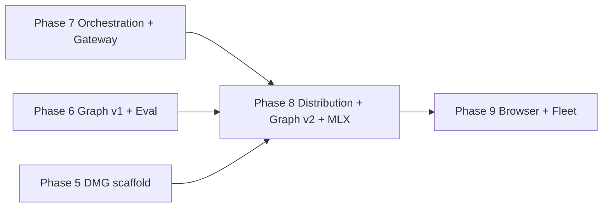

# AetherForge Roadmap — Phase 8

**Baseline:** Phase 7 complete — Darwin **18/18 harness (18 hard / 0 soft)** · slice 7.10 docs/CI closure @ `91bfc01`  
**Prerequisite wedge:** [ROADMAP_PHASE_8.0.md](./ROADMAP_PHASE_8.0.md) — honesty + closed loop **must complete before slice 8.1 below**  
**Canonical platform:** Darwin (macOS 15+ Apple Silicon)  
**Linux CI:** fail-closed for FS-02, MEM-01, ROUT-01, GRAPH-01, LOOP-02 when `sandbox-exec` or Ollama absent  
**Binding spec:** This document is the Phase 8 contract. Every shipped claim maps to a harness task or an explicit deferral below. **Planning only — no implementation in this document.**

> **Phase 8.0 gate:** [ROADMAP_PHASE_8.0.md](./ROADMAP_PHASE_8.0.md) ("Honesty + Closed Loop") must complete **before** any slice 8.1+ below (DMG, graph v2, MLX). Slice 8.0a (IPC lockdown + NL planner de-harnessing) is the first implementation step.

---

## Phase 8 Executive Summary

Phase 8 closes the **distribution**, **memory depth**, and **local inference** gaps left after Phase 7 proved bounded orchestration. Phase 7 delivered automation triggers, maker-checker verification, and a grant-gated gateway wedge — all frozen at 18/18. Phase 8 extends that foundation with a **notarized signed DMG + Sparkle updates**, **graph v2** (multi-hop retrieval, community structure, recency decay), **direct MLX / GGUF runtime** (Ollama optional), and **meta-critique backlog** items that prevent honest regressions (live ingest eval, default loop token cap, GATE-02 production adapters).

**Five bullets for stakeholders:**

1. **Signed distribution wedge** — `codesign --deep`, Apple notarization, Homebrew cask, Sparkle auto-updater; CI verifies artifact signatures before README claims "installable."
2. **Graph v2 is recall-first** — hop depth >1, Leiden community detection, hierarchical summaries, decay/recency weighting; optional Kuzu backend behind feature flag; no force-directed UI theater.
3. **Direct MLX runtime** — hf-hub model downloader, `llama-cpp-2` GGUF path, `mlx-rs` sidecar for Apple Silicon, model registry TOML, mlx-vlm vision hook, quantization picker in SwiftUI.
4. **Harness grows 18 → 21–22 (all hard)** — INGEST-01 (live Ollama extract eval), GRAPH-02 (multi-hop recall@k delta), GATE-02 (Telegram/Discord production adapter round-trip), MLX-01 (local inference without Ollama); BUDG-01 optional for default token cap enforcement.
5. **Explicit deferrals** — Lightpanda/browser MCP (preconditions documented), fleet orchestration at scale, LLM-as-judge without calibration, OmniRoute, graph viz UI, shadow/A/B prod.

---

## Global Gates & Honesty Rules (Phase 8)

These inherit Phases 1–7 gates and add Phase 8-specific rules.

| Gate | Rule |
|------|------|
| **Hard green** | New tasks (INGEST-01, GRAPH-02, GATE-02, MLX-01) are **hard** only when production crate code enforces the invariant — not harness-only mocks without grant checks. |
| **README scoreboard** | README must show `X/N harness (Y hard)` — never claim 21/21 without `cargo run -p golden-harness` on Darwin with Ollama warm per ROUT pattern. |
| **Darwin canonical** | DMG notarization, MLX sidecar, and Sparkle feed are Darwin-only release artifacts; document Linux build/test scope honestly. |
| **Linux fail-closed** | MLX-01, DMG signing, Sparkle — explicit N/A or FAIL-CLOSED; never claim macOS distribution green on Linux CI. |
| **Regression lock** | All 18 Phase 1–7 tasks must remain PASS before claiming Phase 8 complete. |
| **No ingest theater** | INGEST-01 green requires live Ollama extract on fresh transcript fixture — not `extract_json` seed replay. |
| **No graph v2 theater** | GRAPH-02 green requires measurable recall@k improvement over GRAPH-01 baseline on expanded gold set — not edge-count dashboards. |
| **No MLX theater** | MLX-01 green requires inference through registry-selected GGUF/MLX weights — not HTTP proxy to Ollama disguised as "local." |
| **No DMG theater** | Signed/notarized DMG must pass `spctl --assess --type execute` and `codesign --verify --deep --strict` in CI — not unsigned `.app` zip. |
| **Browser deferral** | Lightpanda MCP + `sandbox_browser.sb` remain deferred until GATE-02 green **and** browser grant security review (see Preconditions). |

---

## Phase 8 — Distribution + Graph v2 + Direct MLX

### Phase Goal & Thesis

Phase 8 proves that **AetherForge is shippable as a local-first product** — not only verifiable in harness. The thesis: notarized DMG + Sparkle updates remove install friction; graph v2 multi-hop + community summaries improve recall beyond 1-hop RRF without GraphRAG scope explosion; direct MLX/GGUF runtime decouples inference from Ollama daemon flake (ROUT-01 sensitivity); live ingest eval and default loop token caps close meta-critique honesty gaps from Phase 6–7 audits.

### Prerequisites

| Prerequisite | Evidence |
|--------------|----------|
| Phase 7 complete | Darwin **18/18 (18 hard / 0 soft)** — `cargo run -p golden-harness` |
| AUTO-01, CHECK-01, GATE-01 green | Orchestration + gateway wedge frozen |
| Independent Phase 7 audit | Canvas + ROADMAP_PHASE_7.md checklist ticks |
| Phase 5 DMG scaffold | Existing `.app` bundle + packaging scripts (unsigned baseline) |
| GRAPH-01 green | recall@3 on 5-query gold set (1-hop baseline) |
| GATE-01 green | Slack mock grant round-trip |

**Do not start Phase 8 implementation until Phase 7 is pushed to `main` and independently audited.**

**Do not start Phase 8 slices 8.1+ (distribution, graph v2, MLX) until [Phase 8.0](./ROADMAP_PHASE_8.0.md) honesty + closed-loop wedge is complete and audited.**

**Browser / Lightpanda preconditions (explicit deferral gate):**

| Precondition | Required before browser slice |
|--------------|-------------------------------|
| GATE-02 green | Telegram or Discord production adapter with grant gate |
| `BrowserGrant` capability type | PermissionManager extension + audit |
| `profiles/sandbox_browser.sb` | Seatbelt profile reviewed |
| RED-01 extended cases | Browser-surface adversarial prompts (≥4 new cases) |
| Security review sign-off | Documented in `docs/BROWSER.md` |

Until all preconditions pass, **Lightpanda MCP remains Phase 9+ deferral** — do not claim browser automation in Phase 8.

---

### Architecture Delta

```
Phase 7 (today)                         Phase 8 (target)
─────────────────                       ─────────────────

┌─────────────┐                         ┌─────────────┐
│  SwiftUI    │                         │  SwiftUI    │
│  App        │                         │  App + Sparkle│
└──────┬──────┘                         │  quant picker │
       │ TCP                                   │ TCP
┌──────▼──────────────────────────┐    ┌──────▼──────────────────────────┐
│ aether-daemon                   │    │ aether-daemon                   │
│  OrchestrationGraph             │    │  OrchestrationGraph (unchanged)   │
│  AutomationScheduler            │    │  + LoopConfig default max_tokens  │
│  GatewayRouter (Slack mock)     │    │  + IngestEvalRunner (INGEST-01)   │
│  Ollama-only inference          │    │  + ModelRegistry (TOML)           │
└──────┬──────────────────────────┘    │  + mlx-rs sidecar OR llama-cpp-2  │
       │                               └──────┬──────────────────────────┘
┌──────▼──────────────────────────┐            │
│ aether-db (graph v1, 1-hop)     │    ┌──────▼──────────────────────────┐
└─────────────────────────────────┘    │ aether-db graph v2                │
                                       │  multi-hop traversal (>1)         │
                                       │  Leiden communities + summaries   │
                                       │  decay/recency edge weights       │
                                       │  optional Kuzu adapter (feature)  │
                                       └───────────────────────────────────┘

Distribution delta:
  unsigned .app  →  codesign --deep + notarytool + stapled DMG
  manual install →  Homebrew cask + Sparkle appcast feed
  Ollama-only    →  registry TOML: ollama | gguf | mlx backends
```

**Query path delta:**

```
User query
    ├─► hybrid RRF (FTS5 + vec KNN)           [Phase 4–6, retained]
    ├─► 1-hop graph rank                      [Phase 6 GRAPH-01 baseline]
    └─► Phase 8 additions:
          ├─► multi-hop expansion (depth 2–3, bounded fan-out)
          ├─► Leiden community boost (precomputed offline)
          ├─► hierarchical summary nodes (rollup entities)
          └─► recency decay: weight *= exp(-λ * age_days)
```

**Inference path delta:**

```
run_task / ROUT-01
    ├─► backend: ollama     (retained, default during migration)
    ├─► backend: gguf       (llama-cpp-2, CPU/GPU GGUF)
    ├─► backend: mlx        (mlx-rs sidecar, Apple Silicon)
    └─► backend: mlx-vlm    (vision attachments, optional slice)
```

---

### File / Crate Touch List (Projected)

| Path | Phase 8 change |
|------|----------------|
| `crates/aether-core/src/model_registry.rs` *(new)* | TOML registry: backend, path, quant, context_len |
| `crates/aether-core/src/mlx_sidecar.rs` *(new)* | Spawn mlx-rs inference process; IPC protocol |
| `crates/aether-core/src/gguf_backend.rs` *(new)* | llama-cpp-2 GGUF load + generate |
| `crates/aether-core/src/hf_hub.rs` *(new)* | hf-hub model downloader + checksum pin |
| `crates/aether-db/src/graph_v2.rs` *(new)* | Multi-hop, Leiden, summaries, decay weights |
| `crates/aether-db/src/kuzu_adapter.rs` *(new, optional)* | Feature-gated Kuzu graph backend |
| `crates/aether-daemon/src/ingest_eval.rs` *(new)* | Live Ollama extract eval runner (INGEST-01) |
| `crates/aether-daemon/src/loop_defaults.rs` *(new)* | Sane default max_tokens (not 0/unlimited) |
| `crates/aether-daemon/src/gateway/telegram.rs` | GATE-02 production adapter (bot API) |
| `crates/aether-daemon/src/gateway/discord.rs` | GATE-02 production adapter (gateway intent) |
| `apps/AetherForge/Sparkle/` *(new)* | Sparkle 2.x feed + EdDSA key in Keychain |
| `packaging/dmg/` *(extend)* | codesign --deep, notarytool, staple |
| `packaging/homebrew/` *(new)* | Cask formula + SHA256 pin |
| `models/registry.toml` *(new)* | Default model catalog |
| `tests/golden_harness/src/ingest01.rs` *(new)* | INGEST-01 live extract eval |
| `tests/golden_harness/src/graph02.rs` *(new)* | GRAPH-02 multi-hop recall@k |
| `tests/golden_harness/src/gate02.rs` *(new)* | GATE-02 Telegram/Discord round-trip |
| `tests/golden_harness/src/mlx01.rs` *(new)* | MLX-01 local inference without Ollama |
| `docs/DISTRIBUTION.md` *(new)* | Signing, notarization, Sparkle, Homebrew |
| `docs/GRAPH_V2.md` *(new)* | Multi-hop, Leiden, decay semantics |
| `docs/MODEL_REGISTRY.md` *(new)* | TOML schema, quant picker, hf-hub flow |
| `docs/LINUX_CI.md` | Updated matrix for Phase 8 tasks |
| `README.md` | Phase 8 status; N/N scoreboard when earned |

---

### Harness Tasks (Phase 8 Additions)

Full suite after Phase 8: **21–22 tasks (all hard)** on Darwin.

| Task | Tier | Acceptance criteria | Evidence path |
|------|------|---------------------|---------------|
| **INGEST-01** | **hard** | Fresh transcript fixture → live Ollama `graph_extract` → valid schema → entities inserted → recall@1 on extracted entity query ≥ threshold. Forbidden: replay frozen `extract_json` seed. | `tests/golden_harness/src/ingest01.rs` |
| **GRAPH-02** | **hard** | Expanded gold set (≥8 queries): multi-hop recall@3 ≥ GRAPH-01 baseline + δ (≥0.1 absolute or ≥5% relative). Leiden community signal must change ranking on ≥2/8 queries. Forbidden: hop depth without recall delta. | `tests/golden_harness/src/graph02.rs` |
| **GATE-02** | **hard** | Mock Telegram **or** Discord bot API round-trip: deny without grant → audit; with grant → normalized prompt → `run_task` → response artifact. Forbidden: normalize-only stub without TCP/API mock. | `tests/golden_harness/src/gate02.rs` |
| **MLX-01** | **hard** | Registry TOML selects `mlx` or `gguf` backend → generate completion on frozen prompt → TTFT logged. Forbidden: HTTP call to Ollama when backend ≠ ollama. Skip FAIL-CLOSED when no MLX weights in CI cache. | `tests/golden_harness/src/mlx01.rs` |
| **BUDG-01** *(optional)* | **hard** | Daemon default `max_tokens` > 0; exceed → `BudgetExceeded` + audit. Frozen plan that would exceed cap must hard-stop. | extend `loop_engine.rs` + harness |

**Retained Phase 1–7 tasks (regression lock):** all 18 tasks — **hard**, unchanged tiers.

---

### Implementation Slices (Ordered, Vertical)

Each slice is independently shippable and must not break the 18-task regression lock until the final harness slice merges.

| Slice | Scope | Ship signal | Harness impact |
|-------|-------|-------------|----------------|
| **8.1** | Loop default token cap (`max_tokens` sane default) | Daemon rejects runaway without explicit override | Optional **BUDG-01** |
| **8.2** | Live ingest eval runner + fixture transcript | Extract → insert → query path wired | None (prep) |
| **8.3** | **INGEST-01** harness + live Ollama extract gold | No fixture seed replay | **+1 → 19/19** |
| **8.4** | Graph v2 multi-hop traversal + decay/recency weights | `search_hybrid_with_graph_v2` API | None |
| **8.5** | Leiden community detection (offline job) + hierarchical summary nodes | Community IDs on nodes; summary rollup | None |
| **8.6** | **GRAPH-02** harness + expanded gold queries | recall@k delta vs GRAPH-01 | **+1 → 20/20** |
| **8.7** | Optional Kuzu adapter (feature flag `kuzu-graph`) | Adapter passes unit tests; SQLite remains default | None |
| **8.8** | GATE-02 Telegram **or** Discord production adapter | Mock bot API round-trip in harness | **+1 → 21/21** |
| **8.9** | Model registry TOML + hf-hub downloader | Download + checksum pin; registry parse | None |
| **8.10** | llama-cpp-2 GGUF + mlx-rs sidecar + quant picker UI | Generate via non-Ollama backend | None |
| **8.11** | **MLX-01** harness + mlx-vlm vision hook (optional) | Local inference green | **+1 → 22/22** |
| **8.12** | Signed DMG + notarization + Homebrew cask + Sparkle | CI signature verify; appcast feed | None (CI artifact gate) |
| **8.13** | Docs + Linux CI + README scoreboard | Phase 8 complete checklist | Final audit — **shipped** |

**Slice ordering rationale:** honesty fixes (8.1–8.3) and graph depth (8.4–8.6) ship before inference migration (8.9–8.11) so MLX-01 does not mask ingest/graph regressions. Distribution (8.12) is last — only claim "installable" when signatures verify.

---

### Anti-Theater Checklist (What NOT to Claim Green)

| Do NOT claim | Because | Required proof |
|--------------|---------|----------------|
| "Graph v2 shipped" | Multi-hop without recall delta = hop theater | GRAPH-02 recall@k ≥ baseline + δ |
| "Live ingest works" | Fixture seed replay ≠ Ollama extract | INGEST-01 on fresh transcript |
| "MLX local inference" | Ollama proxy ≠ direct runtime | MLX-01 with `backend != ollama` |
| "Notarized DMG shipped" | Unsigned zip ≠ distribution | `spctl --assess` + CI codesign verify |
| "Telegram/Discord live" | normalize stub ≠ production adapter | GATE-02 mock API round-trip |
| "Kuzu graph backend" | Feature flag off by default | Unit tests + opt-in docs only |
| "Browser automation" | Lightpanda preconditions unmet | See Browser Preconditions table |
| "22/22 on Linux" | MLX-01, DMG, Sparkle Darwin-only | LINUX_CI.md honest matrix |
| "Loop budget enforced" | Opt-in cap only | BUDG-01 or daemon default > 0 |
| "Fleet orchestration" | Phase 8 ≠ multi-session coordinator | Explicit deferral |

---

### Success Metrics

| Metric | Target | Measurement |
|--------|--------|-------------|
| **Harness score (Darwin)** | **21–22/21–22 (all hard)** | `cargo run -p golden-harness` |
| **Regression lock** | 18/18 Phase 1–7 tasks PASS | Same run |
| **INGEST-01 extract validity** | 100% schema-valid on fixture | `ingest01.rs` |
| **GRAPH-02 recall delta** | ≥ baseline + δ on 8-query gold | `graph02.rs` |
| **GATE-02 grant deny** | 100% without grant | `gate02.rs` |
| **MLX-01 non-Ollama path** | Completion on frozen prompt | `mlx01.rs` |
| **DMG signature verify** | CI green on stapled artifact | packaging CI job |
| **Shippable slices** | **12/13 slices** merge without breaking prior harness | Per-slice PR |
| **Sparkle update check** | Appcast fetch + EdDSA verify (staging) | Manual + CI smoke |

---

### Linux CI Expectations

| Task | Linux CI | Notes |
|------|----------|-------|
| Phase 1–7 retained | Unchanged | See [LINUX_CI.md](./LINUX_CI.md) |
| **INGEST-01** | **FAIL-CLOSED** | Requires live Ollama extract |
| **GRAPH-02** | **FAIL-CLOSED** | Requires Ollama embeddings + multi-hop eval |
| **GATE-02** | PASS expected | localhost mock bot API; no real tokens |
| **MLX-01** | **FAIL-CLOSED** | No MLX weights / sidecar on Linux CI |
| **BUDG-01** | PASS expected | Rule-based budget; no Ollama |
| DMG / Sparkle / notarization | **N/A** | Darwin release job only |

**Expected Linux score:** 14–15/22 depending on Ollama service and BUDG-01. Document in `docs/LINUX_CI.md`.

**PR subset (fast path):** extend Phase 7 eleven to include GATE-02 mock + BUDG-01 (no Ollama, no MLX).

**Nightly / Darwin gate:** full 21–22/21–22.

---

### Checks & Balances

- **Must NOT regress:** All 18 Phase 1–7 harness tasks.
- **Audit gate:** MLX backend selection cannot bypass `PermissionManager` or grant checks.
- **Audit gate:** GATE-02 adapters reuse `GatewayGrant` — no bypass for Telegram/Discord.
- **Audit gate:** Graph v2 multi-hop must respect query budget (max nodes expanded per query).
- **Honesty:** INGEST-01 fail closed when Ollama offline — same rule as GRAPH-01.
- **Honesty:** MLX-01 FAIL-CLOSED when registry weights absent — never skip silently.
- **Honesty:** Browser/Lightpanda not in Phase 8 scope until preconditions table satisfied.

---

### Regression Lock

FS-01, FS-02, GIT-01, CODE-01, ROUT-01, MCP-01, MEM-01, GRAPH-01, SKILL-01, SKILL-02, SAFE-01, RED-01, RES-01, LOOP-01, LOOP-02, AUTO-01, CHECK-01, GATE-01, **INGEST-01**, **GRAPH-02**, **GATE-02**, **MLX-01** [, **BUDG-01**].

---

### Definition of Done

- Harness: **21–22/21–22 (all hard)** on Darwin with Ollama running and ROUT warmup.
- README shows Phase 8 status and accurate scoreboard.
- `docs/DISTRIBUTION.md` documents signing, notarization, Sparkle, Homebrew cask.
- `docs/GRAPH_V2.md` documents multi-hop, Leiden, decay semantics.
- `docs/MODEL_REGISTRY.md` documents TOML schema and quant picker.
- `docs/LINUX_CI.md` updated with INGEST-01, GRAPH-02, MLX-01 fail-closed rows.
- CI verifies stapled DMG signatures on Darwin release job.
- Independent audit checklist below passes.
- Commits pushed to `main`.

---

### Dependencies

| Dependency | Phase |
|------------|-------|
| Phase 7 complete (18/18 harness, orchestration, gateway) | Phase 7 |
| Graph v1 + GRAPH-01 baseline | Phase 6 |
| DMG packaging scaffold | Phase 5 |
| Keychain BYOK + gateway tokens | Phase 5–7 |
| hf-hub, llama-cpp-2, mlx-rs crates | External (version pins in workspace) |
| Sparkle 2.x | External (EdDSA key in Keychain) |
| Apple Developer ID + notarytool | Release credentials |

---

### Explicitly Deferred (Phase 8 doc — not in scope)

| Item | Deferral rationale | Precondition to revisit |
|------|-------------------|-------------------------|
| **Lightpanda / browser MCP** | Browser grant + sandbox + RED-01 extension | Browser Preconditions table |
| **Fleet orchestration** | Multi-session coordinator not MVP | CHECK-01 green 30 days + Phase 8 audit |
| **LLM-as-judge** | Judge theater without calibration | 50-case human rubric frozen |
| **OmniRoute** | Out of scope | N/A |
| **Graph visualization UI** | Graph theater without query eval | GRAPH-02 green |
| **Full GraphRAG / Graphiti** | Scope explosion | Graph v2 metrics plateau |
| **Shadow run / A/B prod** | No prod fleet | Daemon log-only mode |
| **Kuzu as default backend** | SQLite proven at 18/18 | GRAPH-02 green + perf benchmark |
| **Both Telegram AND Discord in GATE-02** | One production adapter sufficient | Ship one; second optional 8.8b |

---

### Risk / Rollback

| Risk | Mitigation |
|------|------------|
| MLX sidecar crash | Fallback to Ollama backend in registry TOML |
| Notarization CI flake | Retry staple; document manual fallback |
| Graph v2 recall regression | GRAPH-02 blocks merge; retain v1 code path flag |
| GATE-02 API drift | Mock-first harness; adapter version pin |
| hf-hub download size | Quant picker defaults to small models; cache in CI |
| Sparkle key compromise | EdDSA key in Keychain; rotate via appcast bump |
| Default token cap breaks workflows | Env override `AETHER_MAX_TOKENS=0` documented |

**Rollback:** Revert Phase 8 commits; harness returns to **18/18** at Phase 7 tag `91bfc01`.

---

### Relationship to v1.2.4 Backlog

| v1.2.4 §6 Backlog item | Phase 8 disposition |
|------------------------|---------------------|
| macOS installable app (DMG) | **Extended** — signed, notarized, Sparkle, Homebrew cask |
| Direct MLX / llama.cpp runtime | **Addressed** — MLX-01 + model registry |
| GraphRAG megastack | **Partial** — graph v2 bounded multi-hop, not Graphiti |
| Browser automation | **Deferred** — preconditions documented |
| Full Loop engine token economics | **Addressed** — default max_tokens + BUDG-01 |
| OpenClaw gateway (Telegram/Discord) | **Extended** — GATE-02 production adapter |

v1.2.5 canonical spec patch should incorporate Phase 7 orchestration and Phase 8 distribution/graph/inference deltas — not before Phase 8 audit passes.

---

### Independent Audit Checklist (Phase 8 — pre-ship)

- [ ] INGEST-01 uses live Ollama extract, not fixture seed replay
- [ ] GRAPH-02 demonstrates recall delta over GRAPH-01 on ≥8 gold queries
- [ ] GATE-02 denies inbound without GatewayGrant on Telegram or Discord mock
- [ ] MLX-01 completes inference without Ollama when backend ≠ ollama
- [ ] DMG passes `codesign --verify --deep --strict` and `spctl --assess` in CI
- [ ] Sparkle appcast EdDSA signature verifies
- [ ] Homebrew cask SHA256 matches released DMG
- [ ] Daemon default `max_tokens` > 0 (or BUDG-01 green)
- [ ] README scoreboard matches `cargo run -p golden-harness` on Darwin
- [ ] Linux CI docs list INGEST-01, GRAPH-02, MLX-01 fail-closed
- [ ] Phase 1–7 tasks still PASS (regression lock)
- [ ] Browser/Lightpanda **not** claimed in README or Phase 8 marketing

---

## Phase Dependency Graph (Updated)



---

## Scoreboard History (Projected)

| Milestone | Harness | Hard | Soft | Notes |
|-----------|---------|------|------|-------|
| Phase 7 complete | 18/18 | 18 | 0 | AUTO-01, CHECK-01, GATE-01 |
| Phase 8 slice 8.3 | 19/19 | 19 | 0 | +INGEST-01 |
| Phase 8 slice 8.6 | 20/20 | 20 | 0 | +GRAPH-02 |
| Phase 8 slice 8.8 | 21/21 | 21 | 0 | +GATE-02 |
| **Phase 8 complete** | **22/22** | **22** | 0 | +MLX-01 (+ optional BUDG-01) |

---

*Phase 8 binding spec · synthesized from Phase 7 completion audit + distribution/graph/MLX research + meta-critique backlog · 2026-07-25 · planning only*
